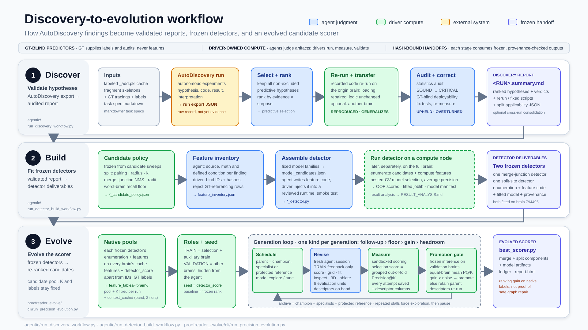

# exa-spim-agent

Agentic discovery-to-evolution workflow for ExaSPIM neuron proofreading. Starting
from labeled skeleton caches, the repository

1. turns AutoDiscovery experiment exports into reproduced, audited discovery reports,
2. compiles the surviving findings into frozen split- and merge-error detectors, and
3. evolves a scorer that re-ranks each detector's own candidates behind a
   held-out promotion gate.



The figure is the map for this document ([SVG source](end_to_end_workflow_diagram.svg)). Per-stage diagrams live beside their
drivers: [`agentic/discovery_workflow_diagram.svg`](agentic/discovery_workflow_diagram.svg),
[`agentic/detector_build_workflow_diagram.svg`](agentic/detector_build_workflow_diagram.svg),
[`agentic/split_merge_detection_pipeline.svg`](agentic/split_merge_detection_pipeline.svg),
[`proofreader_evolve/workflow_diagram.svg`](proofreader_evolve/workflow_diagram.svg) (step-level detail) and
[`proofreader_evolve/workflow_overview.svg`](proofreader_evolve/workflow_overview.svg) (one-page visual overview) and
[`proofreader_evolve/data_overview.svg`](proofreader_evolve/data_overview.svg) (the data model: rows, columns, contexts, labels).

## Workflow at a glance

| Stage | Driver | Consumes | Produces |
|---|---|---|---|
| 1. Discover | `agentic/run_discovery_workflow.py`, `agentic/run_consolidation_workflow.py` | one AutoDiscovery run export `autodiscovery/<RUN>.json` plus the origin `_add.pkl` cache | `autodiscovery/<RUN>.summary.md` with per-hypothesis verdicts, re-runnable hypothesis scripts, a split feature-applicability manifest |
| 2. Build | `agentic/run_detector_build_workflow.py`, `agentic/detector_build/` | the finished report and its scripts, candidate-pool sweep evidence | `autodiscovery-application/<RUN>/`: frozen candidate policy, feature inventory, model configuration and detector script; after a compute-node run, out-of-fold scores, a fitted model and its provenance |
| 3. Evolve | `proofreader_evolve/` | one frozen merge-junction detector, one frozen split-site detector, labeled caches for every brain | `proofreader_evolve/runs/precision_*/best_scorer.py` with ledger, traces and `report.html` |

Three rules hold in every stage:

- **GT-blind predictors.** Ground truth supplies labels, audits and evaluation; it
  never enters a feature, a candidate rule or a scorer. Discovery flags
  GT-referencing hypotheses, detector builds hard-reject them, and evolution
  workers never receive labels or candidate identities.
- **Driver-owned compute.** Agents read artifacts on disk and write judgments,
  code or prose. The drivers run every long computation, measure results and
  validate what the agents produced. No agent turn owns a dataset load.
- **Hash-bound handoffs.** Each stage consumes the previous stage's outputs by
  exact path and SHA-256: selection manifests, rerun scripts, inventories,
  detector sources, fitted joblibs and feature tables. Stale or mismatched inputs
  fail instead of being substituted silently.

## Prerequisites

### Environment

Every Python command in this repository runs in the `panda` conda environment,
which provides the `agentic_neuron_proofreader` package that defines
`SkeletonGraph` (source: [AllenInstitute/neuron-proofreader](https://github.com/AllenInstitute/neuron-proofreader)):

```bash
conda activate panda
```

Loading an `_add.pkl` cache needs more than 20 GB of RAM, so every step that
touches a dataset runs on a compute node:

```bash
#!/bin/bash
#SBATCH --mem=80G
source /shared/utils.x86_64/anaconda3-2024.10/etc/profile.d/conda.sh
conda activate panda
cd /allen/programs/mindscope/workgroups/auto-model/zihan.zhang/exaspim-agent/exa-spim-agent
python your_script.py
```

Agent steps need `ANTHROPIC_API_KEY`. Steps that read raw image patches from
public S3 need `AWS_EC2_METADATA_DISABLED=true`; building caches needs GCS
credentials at `configs/allen-nd-goog-f5d46dbfa2cd.json`. The caches themselves load fully
offline.

### Data: labeled caches

Every stage reads `cache/dataset_cache_<brain>_mcl<N>_add.pkl`, a pickle holding
the UNet fragment reconstruction (`fragments_graph`), the human ground-truth
tracings (`gt_graph`) and baked-in error labels (`gt_node_canonical_label`,
`gt_edge_error`, `gt_merge_labels`, `gt_merge_sites`).
[Appendix A](#appendix-a-data-preparation-labeled-caches) explains how the
caches are built and verified;
[`markdowns/labeled_dataset_cache.md`](markdowns/labeled_dataset_cache.md) holds
the schema. Quick load:

```python
import pickle
import agentic_neuron_proofreader  # noqa — registers SkeletonGraph

with open("cache/dataset_cache_794495_mcl100_add.pkl", "rb") as f:
    payload = pickle.load(f)
frag, gt = payload["fragments_graph"], payload["gt_graph"]
```

The GT graphs cover tens of neurons per brain, so GT-derived labels are sparse
annotations rather than exhaustive truth: label 0 means "no recorded error
here", not a verified clean location. Every downstream metric inherits this.

## Stage 1. Discover: from AutoDiscovery exports to a validated report

### 1.1 AutoDiscovery runs

AutoDiscovery is an external autonomous-experimentation system. A run is pointed
at one labeled cache and one task specification from `markdowns/`
(`merge_detection_from_fragments.md`, `split_detection_from_fragments.md` and
their image-aware variants). The specification separates GT-informed
characterization from GT-blind detection and names the cache fields a detector
may never read. Each experiment the system performs records its hypothesis,
analysis code, numerical result and interpretation; the whole run is exported
as one JSON file saved as

```text
autodiscovery/<kind>-error-<brain>-mcl<N>[-<variant>]_<date>.json
```

for example `autodiscovery/merge-error-794495-mcl100_2026-08-04.json`. This
export is the raw experimental record. Nothing in it counts as evidence until
the validation workflow below has reproduced and audited it.

### 1.2 Validate one run

```bash
conda activate panda
python agentic/run_discovery_workflow.py \
    autodiscovery/<RUN>.json \
    --pkl cache/dataset_cache_<brain>_mcl<N>_add.pkl \
    --direction predictive \
    --extra-pkl cache/dataset_cache_<other-brain>_mcl<N>_add.pkl   # optional transfer test
```

The driver alternates agent steps, which run in fresh Claude Agent SDK sessions
and operate only on files already on disk, with compute steps, which the driver
runs itself as blocking subprocesses. The phases, in order:

| Phase | Kind | What happens |
|---|---|---|
| summarize | agent | Select the hypotheses to keep and rank them by evidence and surprise. `--direction predictive` keeps every hypothesis except explicit exclusions (invalid, constant, non-predictive, confounded); `positive` and `both` apply a top-K cut instead. |
| reproduce | compute + agent | Re-run every recorded analysis on the origin cache, export editable scripts, let an agent repair data-loading failures without touching the logic, re-measure only changed scripts (up to 3 repair rounds) and fold `REPRODUCED` · `DIVERGED` · `FAILED` verdicts. |
| extrapolate | compute + agent | With `--extra-pkl`, run the reproduced code unchanged on another brain and fold `GENERALIZES` · `PARTIAL` · `DOES-NOT-GENERALIZE` · `INCONCLUSIVE`. |
| verify | agent | Audit test choice, effect size, power and multiple comparisons; grade `SOUND` · `WEAK` · `MINOR` · `MAJOR` · `CRITICAL`, and mark each feature `BLIND-COMPUTABLE` or `GT-REFERENCING`. |
| fix-tests | agent + compute | Write corrected tests for `MAJOR`/`CRITICAL` findings, re-measure them and fold `UPHELD` · `WEAKENED` · `OVERTURNED`. |
| feature-applicability | agent + driver | Split runs only: classify the node-role requirement of every rerun or fixed source and bind it to the source hash. |

Everything folds into one report with a fixed top-level order: Header, Ranked
Conclusions, Reproduction, Generalization, Statistical Verification, Statistical
Test Corrections, then the Excluded appendix. The driver writes, beside the input
JSON:

| Artifact | Content |
|---|---|
| `<RUN>.summary.md` | the report every later stage reads |
| `<RUN>.predictive-selection.json` | the cached exclusion-only selection, reused while the run hash and policy version match |
| `<RUN>.json.predictive.rerun/hypo_<id>.py`, `.fixed/hypo_<id>.py` | the exact re-runnable hypothesis sources that Stage 2 inventories |
| `<RUN>.json.predictive.{reproduce,extrapolate,corrected}.json` | measured results per phase |
| `<RUN>.split-feature-applicability.json` | split only: source-bound node-role requirements |
| `<RUN>.json.predictive.workflow.log.txt` | the full console log, ending in an `# OK/FAILED` footer |

Compute steps reuse an existing result JSON whenever it parses and is non-empty;
there is no `--force`, so delete an artifact to recompute it. Agent-step timeouts
scale with the hypothesis count; compute steps get a 24-hour budget and each
experiment script a 1-hour cap. `--smoke` prints the selected hypothesis IDs and
stops without loading data. The `.claude/agents/discovery-*.md` files define the
subagents; `agentic/tests/` holds the unittest suite
(`python -m unittest discover -s agentic/tests`).

### 1.3 Consolidate across runs and rank

```bash
python agentic/run_consolidation_workflow.py        # -> autodiscovery/all-runs.combined.md (+ .zh.md)
python agentic/rank_by_surprise.py autodiscovery/<RUN>.json \
    --rank-by posterior-surprise --direction predictive \
    --predictive-manifest autodiscovery/<RUN>.predictive-selection.json
```

Consolidation clusters equivalent findings across finished reports, keeps one
canonical copy per cluster and lists what is unique and new; it re-runs nothing
and re-judges nothing. The ranking helper reproduces the summarizer's ordering
deterministically. `agentic/collect_summaries.py` gathers report entries across
runs and `agentic/summary_heatmap.py` renders a per-hypothesis verdict heatmap.

## Stage 2. Build: from a validated report to frozen detectors

A detector is one script that enumerates GT-blind candidates over a fragment
graph, computes the inventoried features in shared passes, selects a model under
nested cross-validation and scores every candidate. The build workflow writes
that script from a finished report; it never loads a dataset. Fitting happens
afterwards on a compute node.

### 2.1 Candidate-pool sweeps and the frozen candidate policy

Before any feature is scored, a cheap enumeration rule fixes which candidates
exist at all. Two sweeps measure that ceiling across all labeled brains:

- [`notebooks/split_candidate_pool_sweep.py`](notebooks/split_candidate_pool_sweep.py)
  enumerates segment pairs by pairing mode, maximum gap and per-anchor partner
  quota, and reports candidate count against the fraction of GT split pairs
  reachable in the pool. `agentic/run_split_candidate_result_analysis.py` turns a
  finished bundle into a grounded `AI_REVIEW.md`.
- [`notebooks/merge_candidate_pool_sweep.py`](notebooks/merge_candidate_pool_sweep.py)
  anchors candidates at degree >= 3 fragment nodes with segment-scoped
  non-maximum suppression and a geodesic claim radius, and writes a deterministic
  `recommended_policy.json`.

The build driver re-derives the minimum-candidate-count policy that keeps
worst-brain recall above a floor (0.90 pair recall for split, 0.80 site recall
for merge by default), freezes it as `split_candidate_policy.json` or
`merge_candidate_policy.json`, and embeds the exact policy and its hash in the
detector. Candidate enumeration is therefore fixed before training and cannot be
tuned against labels later.

### 2.2 Build the detector

```bash
conda activate panda
python agentic/run_detector_build_workflow.py autodiscovery/<RUN>.json
```

One persistent Claude session runs the ordered steps so later steps share
earlier context; the driver validates every artifact between steps:

| Step | Agent proposes | Driver validates and writes |
|---|---|---|
| 0. candidate policy | split: interprets the sweep's AI review; merge: no agent turn | re-derives the argmin from sweep evidence; freezes `*_candidate_policy.json` |
| 1. feature inventory | source choice, feature math, aggregation and defined-condition per hypothesis | joins IDs, evidence, paths and hashes; rejects GT-referencing rows; writes `feature_inventory.json` |
| 2. model setup | optional model families with a feature-based rationale | enforces `agentic/detector_model_policy.json` (L2 logistic, histogram gradient boosting and XGBoost always included, at most two extensions, bounded grids); writes `model_candidates.json` |
| 3. detector assembly | the task-specific feature implementation only | AST-validates it, injects it into the reviewed runtime template, runs no-data smoke tests; writes `merge_junction_detector.py` or `split_site_detector.py` |
| 4. verify and document | semantic review of the assembled script against the inventory | README skeleton with an immutable provenance block and `RUN_COMMANDS.md` bound to the artifact hashes |

Deliverables land in `autodiscovery-application/<RUN>/`. Rebuilding into an
existing folder asks for confirmation because it would leave a new script beside
an old run's outputs; `--yes` skips the prompt in batch jobs and `--keep-existing`
reuses validated artifacts. `--merge-row-unit segment` restores the older
segment-level merge detector instead of junction sites. Feature contracts are
documented in [`docs/merge_site_feature_scope.md`](docs/merge_site_feature_scope.md),
[`docs/split_feature_scope.md`](docs/split_feature_scope.md) and
[`docs/detector_cost_validation.md`](docs/detector_cost_validation.md).

### 2.3 Run the detector on a compute node

`RUN_COMMANDS.md` in each deliverable folder is the authoritative, hash-bound
runbook. The shape of a run is:

```bash
sbatch --mem=80G --wrap="\
    source /shared/utils.x86_64/anaconda3-2024.10/etc/profile.d/conda.sh; \
    conda activate panda; \
    python autodiscovery-application/<RUN>/merge_junction_detector.py \
        cache/dataset_cache_<brain>_mcl<N>_add.pkl"
```

The runbook first profiles feature cost on a small sample (`--measuretime`;
`agentic/run_feature_cost_analysis.py` adds the complementary code-structure
view), then runs the chosen hypotheses on the full brain with average precision
as the model-selection objective. A completed run writes out-of-fold candidate
scores (`*_detector_<brain>.csv`), the model-selection manifest
(`model_selection_<brain>.json`, which records the training brain and feature
order that Stage 3 relies on), the fitted winner (`*_<brain>.joblib`), a log and
figures. `agentic/run_detector_result_analysis.py` then produces a grounded
bilingual `RESULT_ANALYSIS.md` from the saved numbers. The GT-site tools in
[Appendix B](#appendix-b-gt-merge-site-inspection-tools) compare a detector's
positives with the cached GT sites.

### 2.4 Detectors currently in use

| Kind | Deliverable | Candidate policy | Fitted on |
|---|---|---|---|
| merge junction sites | `autodiscovery-application/merge-error-794495-mcl100_2026-08-04/` | `junction\|nms=20\|r=150`; worst-brain site recall 0.85 | 794495 |
| split segment pairs | `autodiscovery-application/split-error-794495-mcl100-run-3_2026-08-24/` | `tip_to_any_node\|r=50\|k=2`; worst-brain pair recall 0.91 | 794495 |

These two are the default inputs of Stage 3. Because both were fitted on
794495, that brain can never serve as a validation brain there.

## Stage 3. Evolve: re-rank the frozen candidate pools

The evolution stage keeps everything the detectors decided and changes only the
order in which their candidates are presented. It is an LLM-driven search: a
fresh agent session is the mutation operator, a TRAIN-side selection score ranks
exploration branches, and a held-out validation gate alone decides promotion: the
equal-brain mean Precision@K must rise by more than paired-bootstrap resampling
noise. Generations are allocated between the merge and split components by
pending follow-ups, a floor, recent validated gain and remaining headroom.
The subsections below follow one generation of the loop in the figure; the
maintained design record is
[`proofreader_evolve/WORKFLOW_REVISION.md`](proofreader_evolve/WORKFLOW_REVISION.md).

### 3.1 What is evolved and what stays fixed

`proofreader_evolve` improves **native-label Precision@K on the
same candidate pool** as the selected `merge_junction_detector.py` and
`split_site_detector.py`. The frozen scripts define candidate enumeration,
including split occurrences and junction NMS; evolution cannot change the pool.
Exactly one detector per kind is required.

### 3.2 Prepare tables and launch a run

On an allocated compute node in panda:

```bash
python -u proofreader_evolve/prepare_feature_tables.py --brains 794495 789202 794491 794493 802449 --mcl 100
# Once per brain: fragment neighbourhoods plus level-1 and level-0 image patches for the
# top 20,000 detector-ranked candidates of each kind (S3 reads; roughly 30 min per brain and kind).
python -u -m proofreader_evolve.cli.precompute_context_cache --brains 794495 802449 789202 794493 794491 --mcl 100 --readers 16
python -m proofreader_evolve.cli.preflight --brains 794495 789202 794491 794493 802449 \
  --train-brains 794495 802449 --selection-brains 802449 --mcl 100 \
  --context-cache proofreader_evolve/context_cache
# Full run (the settings of the recorded 2026-10-05 trial, 20 generations):
export ANTHROPIC_API_KEY=...  AWS_EC2_METADATA_DISABLED=true
python -u -m proofreader_evolve.cli.run_evolution \
  --train-brains 794495,802449 --selection-brains 802449 \
  --validation-brains 789202,794493,794491 \
  --merge-k 2000 --split-k 2000 --generations 20 \
  --context-cache proofreader_evolve/context_cache --descriptor-workers auto \
  --classifier-threads 4 --classifier-time-budget 1800 --reviser-max-turns 40 \
  --skip-auxiliary-ablation
# Controls for attribution: --kind-schedule alternate (strict merge/split rotation),
# --promotion-gate margin (point-estimate gate), omit --context-cache (no descriptors).
# Historical in-sample ranking with the detector-fitted TRAIN brain alone:
python -m proofreader_evolve.cli.run_evolution \
  --train-brains 794495 --validation-brains auto --selection-protocol in_sample \
  --merge-k 100 --split-k 100 --generations 1
```

The CLI defaults are a single TRAIN brain **794495**, the `grouped_oof` selection
protocol, the `bootstrap` promotion gate (1000 draws, alpha 0.05), `adaptive` kind
allocation, 15 generations and K = 100 per kind. The bare defaults do **not** start
a run: `grouped_oof` ranks TRAIN branches on a brain the detectors were not fitted
on, and 794495 is the detectors' training brain, so the driver aborts with
"No eligible selection brain". Add a detector-naive TRAIN brain and name it as the
selection brain (`--train-brains 794495,802449 --selection-brains 802449`, as
above), or request the historical `--selection-protocol in_sample`. Evolution
writes its log to the run directory (`runs/precision_<run>/trajectory.txt` and
`.jsonl`, `run_status.json`, `report.html`), not to `proofreader_evolve/log/`;
redirect stdout if you want a console log file.
`--validation-brains auto`
discovers other local MCL-matching `_add.pkl` caches and includes brains whose
merge and split tables pass the existing provenance/integrity checks. TRAIN and
detector-fitted brains are excluded. Missing tables are logged and skipped;
corrupt tables and empty pools fail rather than silently changing the benchmark.
At least one validation brain must be ready. The resolved split is fixed before
the seed evaluation and recorded in `dataset_split.json` and `manifest.json`.
To require an exact set, pass e.g. `--validation-brains 789202,794491,794493`
(TRAIN and validation brains must be disjoint); then any missing input is an error. Evolution never prepares tables itself.

Preparation now uses `dataset_cache_<brain>_mcl100_add.pkl`, preserving the native
detector's annotation definition. Full native pools replace the previous capped
tables; these different schemas cannot be reused interchangeably. Preparation
can still be expensive, especially merge extraction. It does not call an LLM.
Preparation mirrors its console output, including child-process stdout/stderr,
to `proofreader_evolve/log/prepare_feature_tables_<timestamp>_<pid>.log.txt`.
Each run gets a separate log with invocation, timing and exit status. Use
`--log-txt PATH` to append to a specific file; `--dry-run` creates no log.

Evolution and preflight default to `claude-opus-5` (Claude Opus 5).
Use `--model MODEL_ID` to override the model for a run.

### 3.3 Scorer contract and promotion gate

The editable scorer is seeded from `proofreader_evolve/artifacts/scorer.py`:
`score_candidates(features, ctx)` receives only predictor columns plus the frozen
`detector_score` and optional custom local geometry features; `ctx` contains the candidate kind. It must return one finite
score per row. The harness selects exactly min(K, pool size) with deterministic
tie breaking. GT labels are stored separately and never passed to the scorer.
Training feedback includes labeled examples with TRAIN-only inspection handles; validation feedback is
not supplied to the reviser. Promotion uses **mean validation Precision@K only**:
average merge/split precision within each validation brain, then average the
brains with equal weight. The candidate must exceed the accepted parent's mean
by more than `--precision-margin` (default 0; ties fail) and, with the default
`--promotion-gate bootstrap`, the lower bound of the paired row-resampling interval of
that gain must be above zero (`--bootstrap-draws 1000`, `--bootstrap-alpha 0.05`);
`--promotion-gate margin` restores the point-estimate rule. Individual brain/kind
regressions are allowed; TRAIN gain is diagnostic, not a promotion requirement.
Training scores still guide experiment ranking, branch retention and plateau
scheduling. Invalid, non-deterministic or
timed-out scorers are rejected without substituting parent measurements.

K is fixed per run. Both raw detector and evolved scorer are compared on identical
pools and budgets. Returning fewer candidates cannot improve the metric. No graph
edits, pool expansion, on-demand detector queries or post-cut re-enumeration occur.
These are sparse-annotation native labels, not exhaustive biological truth; a
better ranking does not establish safe graph repairs. Repeated validation is
development data, not a final untouched test. Scorer execution uses a separate
feature-only Linux worker with a seccomp syscall filter, wall-time/CPU/memory
limits, and no inherited credentials. File access, network access and child
process creation are denied before candidate code executes. Linux with
`libseccomp.so.2` is required; unavailable isolation fails the evaluation.
See [workflow revision](proofreader_evolve/WORKFLOW_REVISION.md).

The default frozen detectors were fitted on 794495:

- Merge: `merge-error-794495-mcl100_2026-08-04`
- Split: `split-error-794495-mcl100-run-3_2026-08-24`

Pass one `--merge-dir` and one `--split-dir` to select other frozen deliverables.
Detector-fitted brains cannot be validation brains. The reviser requires
`ANTHROPIC_API_KEY`; preparation and baseline-only evaluation do not call an LLM.

### 3.4 One generation: the reviser session

Each generation allows up to 24 SDK interaction turns by default; use
`--reviser-max-turns 40` to change this independently of `--generations`.
The reviser reads a compact TRAIN feedback file capped at 96 KB (48 KB before
2026-10-05). Tool results may be up to 100,000 tokens; a result the SDK still
parks on disk stays readable through the session's file guard. Feature names
appear once per cell with aligned example vectors; values are rounded to six
significant digits for display. It samples selected positives and label-0 rows,
rows just below K, and missed positives. Each group keeps a fixed anchor and
reproducibly rotates other examples across generations, up to four per group
(fewer when needed to fit). `feature_statistics.json` provides whole-TRAIN
feature quartiles by native label, so error samples are not mistaken for the
full distribution. Candidate feedback adds gained/lost positives and Top-K overlap.

Each generation edits one component. By default the kind is chosen adaptively:
a pending promotion follow-up first, then a floor of one revision per
`--kind-floor-every` generations (default 4), then the kind with the larger recent
gate-passing validation gain, then the larger remaining headroom on the validation
cells; `--kind-schedule alternate` restores strict merge/split rotation and
`--target-kind split` or `merge` focuses the search. The harness freezes the other
component. The agent writes its hypothesis, strategy, formula family and numeric
grid to `proposal.json`, then calls `evaluate_train({})` or `search_parameters({})`.
These tools have no text arguments. The default budget is **8 evaluation units**
per generation, configurable with `--train-evaluations-per-generation`; cache hits
and proposal-format errors cost no scoring budget. New configurations and optional
feature-diagnostic fold/arm fits share these units. Tool calls still consume SDK
turns. `search_memory` searches earlier TRAIN experiments, including rejected and
failed attempts. `restore_candidate` accepts an experiment ID, `parent`, or `best`,
and restores measured code without another scorer execution.

The scheduler separates `explore` (design a formula, features or model program)
from `tune` (change numeric values only). Formula scorers expose a literal
`PARAMS = {'weight': 1.0}` dictionary and
reference its values. `search_parameters` enumerates the proposed grid while
keeping the formula fixed, snapshots every configuration and restores the best
successful one by the official selection score. In tune
generations an AST fingerprint enforces the assigned formula. Grid sizes must fit
the remaining budget; oversized grids fail before scoring.

### 3.5 Agent-authored models and the selection protocol

The agent can also author **its own training and prediction program** in
`training.py`, defining `fit(X_train, y_train, artifact_dir, params)` and
`predict(X, artifact_dir, params)`. There is no model whitelist or required
NumPy export. Within installed CPU dependencies and resource limits, the agent
chooses preprocessing, features, model architecture, loss, optimizer, ensembles,
training schedule and file format. `proposal.json.classifier.parameters` supplies
arbitrary JSON settings. `train_classifier({})` runs the program on **TRAIN only**,
saves its artifacts and measures its ranking. See the
[training guide](proofreader_evolve/artifacts/classifier_guide.md) and
[editable example](proofreader_evolve/artifacts/training.py).

Agent code and model deserialization run after Linux Landlock + seccomp isolation.
Installed libraries and supplied inputs are readable; fit can write model files
and scratch space. Prediction receives predictors, declared raw image patches
and read-only model artifacts, without labels. Network, child processes, credentials and unrelated data paths
are unavailable. Unsupported isolation fails closed. The framework cannot prove
that arbitrary prediction code implements frozen preprocessing correctly; that
remains part of the model interface contract.

One new fit plus TRAIN evaluation consumes one shared budget unit; failed fits
also consume one with no metric. Exact training-source/parameter repeats reuse
the fitted model. Explore generations can rewrite the whole program; tune
fixes its AST and nonnumeric settings while refitting numeric parameters.
Defaults are 300 seconds wall/CPU, 8192 MiB and one numerical-library thread
(`--classifier-time-budget`, `--classifier-memory-mb`, `--classifier-threads`);
the recorded full runs use 1800 seconds and 4 threads.
Artifact storage permits 128 MiB / 256 regular files per model. The agent chooses
and records randomness seeds. `model_environment.json` lists installed packages
and budgets; training stdout/stderr is saved and its last 8 KB returned to the agent.

Branches are ranked by the selection protocol: under the default `grouped_oof`,
grouped out-of-fold precision on detector-naive selection brains from host-owned
fold refits, with auxiliary TRAIN brains as fitting-only data; in-sample TRAIN
precision is a **resubstitution diagnostic**. The agent may still use TRAIN-only
internal validation/CV during fitting. Final promotion requires
improvement in mean development-validation precision that clears the paired-bootstrap
noise gate (section 3.3). The outer evaluator calls
frozen feature extraction and predict on validation; it never supplies validation labels to a worker.
`best_scorer.py` binds training source, parameters, provenance and artifact hashes.
Keep its sibling `model_artifacts/` directory when moving/resuming a run; use
`--start-from-artifacts` for another artifact location. Model dependencies are
needed at inference time. Resuming a managed model fitted on a requested
validation brain is rejected before seed evaluation. Legacy NumPy exports remain
readable; newly trained models use the program/artifact interface.

### 3.6 Exploration tools: geometry, 3D volumes, images and feature discovery

The agent can inspect **TRAIN candidate locations and local fragment geometry**
using `inspect_candidate(candidate_ref, radius_um, occurrence_index)`. Feedback
contains the required candidate references. Each generation allows eight
inspections; split pairs support multiple occurrence locations. These are cached,
processed skeletons, not raw images or GT skeletons.

In explore mode, the agent can define `LOCAL_CONTEXT` and
`extract_local_features(context)` in scorer.py or training.py. The host loads the
matching fragment cache, supplies relative nodes/edges/radii and locally numbered
fragments to an isolated worker, and appends its numeric features to the table.
The same frozen extraction runs on validation outside the LLM. Default extraction
covers the 5000 highest detector-score candidates per brain/kind; the agent may
choose another base feature/direction and a budget up to 20000. Every candidate
still receives a score; unselected local features are missing. Graphs are loaded
for requested geometry/image access, local features, or split feature-diagnostic grouping;
existing prepared tables remain valid. See the
[local context guide](proofreader_evolve/artifacts/local_context_guide.md) for the
schema, feature example, limits and logs. No new launch flag is required.

With `--context-cache`, the primary image path is **pool-scale agent descriptors**.
`precompute_context_cache` stores, once per brain and kind, the raw context of the
top 20,000 detector-ranked candidates: the fragment neighbourhood (50 um, up to
256 nodes) and image patches at level 1 (30 um radius) and level 0 (16 um radius,
the finest resolution), both for the whole band (level 0 covered only the first
4,000 rows before 2026-10-05; `--extend-tier level0` grows a tier of existing
entries in place). Nothing in the cache is a feature. The agent writes
`descriptor.py` (`DESCRIPTOR` plus `describe(context)`) and calls
`plan_descriptor_run` / `compute_descriptors`; the host runs the code over the
cached rows in parallel sandboxed workers, caches results by code hash in
`descriptor_bank/`, registers them as `bank_agent_*` predictors with
label-conditional TRAIN quartiles, and recomputes them on validation brains at
submission. One uncached call costs one evaluation unit under wall-clock budgets
(`--descriptor-wall-seconds`, `--descriptor-generation-wall-seconds`). See the
[descriptor guide](proofreader_evolve/artifacts/descriptor_guide.md).

Without a context cache, the image exploration path is **agent-written analysis
of actual 3D volumes**. Edit `analysis.py` and `analysis_request.json`, then call
`run_volume_analysis({})`. An isolated worker passes original pixels, validity
masks, spacing, candidate anchors and aligned local fragments to `analyze(context)`.
It returns concise JSON findings, without requiring model fitting or 2D previews.
Each generation has eight executions, up to 16 TRAIN candidates each (enough to
compare a group of missed positives with a group of selected label-0 rows), separate
from scoring. Code, input identities, results and logs are saved under
`genNNN/volume_analyses/analysisNNN/`. See the
[3D analysis guide](proofreader_evolve/artifacts/volume_analysis_guide.md).
Optional `inspect_candidate_image` and `inspect_failure_images({})` tools still
return XY/XZ/YZ PNG previews, with a separate eight-image allowance.

To turn findings into a measured policy,
`LOCAL_IMAGE` enables agent-written image features or raw patches for arbitrary
CPU fit/predict programs through a read-only `images` argument. Pixels keep their
original values; preview contrast normalization is separate. Only TRAIN images
are inspectable. Frozen extraction and prediction use validation images inside
the outer evaluator, without labels or agent inspection. See the
[image guide](proofreader_evolve/artifacts/image_context_guide.md).

To connect small 3D investigations to ranking at larger K, `LOCAL_IMAGE` supports
`selection_mode='top_k_boundary'` with a literal `selection_k`. For K=2000, a
256-row pilot selects ranks 1873..2128 of the declared base predictor; 4000 rows
cover its entire Top 2000 and the next 2000. The agent can call
`plan_image_scoring({})` to preview TRAIN coverage without image IO. Stateless
numeric extraction uses bounded batches with a shared timeout; raw-patch models
retain the 1 GiB staging limit. Future reports distinguish 3D access, actual
Top-K image coverage, and image-only paired TRAIN evidence. Neither access nor
coverage alone demonstrates an image-ranking benefit; the outer mean gate is unchanged.

Image access requires host registration receipts in `configs/image_alignment.json`
(or `--image-alignment PATH`). The reader uses explicit OME-Zarr axes, units,
scale/translation, channel and timepoint. To audit new/changed sources on n257,
run `python -m proofreader_evolve.cli.check_image_alignment --brains BRAIN_IDS
--out docs/image_alignment_review_<DATE>`; use `--image-uri` for an explicit
single-brain source override. Inspect the saved overlays before recording a
receipt with the same brains/output plus `--record-reviewed --review-note "..."`.
This only checks sampled registration, not all candidate locations or error labels.
An unavailable image fails the image-dependent measurement without dropping any
validation brain. Existing table-only policies need no images or credentials.

Feature discovery now starts from bounded matched TRAIN failures and a relevant
hypothesis-evidence record. Since 2026-10-06 the failure cases and feedback examples
describe the assigned search branch rather than the accepted scorer, with a
`branch_vs_accepted` block of positives the branch gains, loses or shares as misses;
and each session can leave a structured `handoff` (open questions, evidence verdicts,
next experiment) in `proposal.json`, which the host stores next to its own
measurements and shows to the next session of that kind in `hypothesis_memory.json`. `inspect_failure_cases({})` batches local inspection;
`evaluate_feature_ablation({})` measures full inputs against a constant-masked
feature group using the same program and parameters. Classifier diagnostics use
the selection protocol's three grouped, fragment-purged folds (two evaluation
units, one per arm); formulas use a descriptive two-arm comparison (two units).
A classifier configuration costs one unit, fold refits included. Evidence is
saved separately from agent claims and
guides soft stagnation scheduling, while the outer promotion gate stays the same.
See the [feature discovery guide](proofreader_evolve/artifacts/feature_discovery_guide.md)
and the maintained [literature provenance](proofreader_evolve/WORKFLOW_REVISION.md#literature-basis-and-implementation-provenance)
for mechanisms, source papers, adaptation limits, and verification status.

### 3.7 Branch archive and scheduling

Each kind retains up to **5 TRAIN exploration branches**: the selection-score champion,
then specialists that recover different GT-positive candidates or lead geometry
slices. Specialists may fall more than **0.02 absolute precision** below the
champion. The tolerance applies only to near-best alternatives filling remaining
slots; distinct Top-K membership and formula structures guide that fallback.
Slice diagnostics use split gap <=25/>25 microns and merge degree 3/>=4, plus
whole-pool coverage for each TRAIN brain. Hits always come from the same global
Top K. Raw positive identities stay in the host; only aggregate counts reach
the agent. All successful trials in a generation compete for the bounded archive.
The exploration parent can differ from the accepted scorer. Pool membership does
not require validation acceptance; the validation mean alone determines promotion.
In addition, each kind has **one protected reference slot** for its current
accepted component, initialized from the seed and updated only after promotion.
It does not consume a TRAIN pool slot and cannot be evicted for a low selection score
or redundant TRAIN coverage. The same snapshot can serve both reference and TRAIN
roles without duplication. A newly promoted component gets the **next generation
of the same kind** in explore mode, ahead of the TRAIN champion and normal cadence
(the adaptive kind allocation of section 3.4 schedules pending follow-ups first).
One new measurement from that workspace branch completes the follow-up; cached
restores do not. At most one retry is reserved. Seeds and unchanged references do
not enqueue follow-ups. Otherwise, every **third scheduled generation of each kind**
starts from the reference; merge and split count independently,
including cache-only or failed generations for this scheduling cadence.
Other generations use the TRAIN champion/specialist scheduler, with
periodic exploration controlled by `--explore-every` on newly measured
non-reference rounds, so protected rounds do not displace specialist exploration.
The scheduler also explores whenever
the champion lacks PARAMS. After **2 measured rounds** without
a new selection-score best, previously uncovered retained positive, or historical
slice-hit best, exploration is forced from an alternative branch if available.
After **2 unsuccessful forced explorations**, that kind can pause once a generation
assigned to its current reference has produced a new successful TRAIN measurement.
Cache-only or failed reference rounds do not satisfy that requirement. A promotion
replaces the reference, resets that kind's stagnation counters and reopens it for
exploration. When all target kinds pause the run ends. Rediscovered positive coverage
does not reset counters. Cache-only rounds and execution/infrastructure failures
do not advance measured-progress counters.
Separately, two completed same-kind rounds without new measurements force an
investigation. Performance plateaus also require a new paired TRAIN feature
ablation or a numerical 3D comparison on at least two distinct TRAIN candidates.
If registered TRAIN images are available and have not yet been compared, the
assignment requires image evidence. Negative measurements count; previews,
inspection repeats, cached restores and plans do not. A priority follow-up and
investigation can share one assignment. Incomplete assignments skip validation
and retain the accepted policy. The default two incomplete assignments or two
consecutive execution-blocked rounds pause that kind with separate reasons.
`research_evidence.jsonl` records actual tool evidence; per-generation
`research_status.json` gives live completion feedback. Code-format changes are
deduplicated, but the framework cannot certify semantic or scientific novelty.
Controls: `--candidate-pool-size`,
`--candidate-score-tolerance`, `--explore-every`, `--plateau-patience`,
`--exploration-patience`, and `--no-early-stop`.

### 3.8 Submission, validation and run artifacts

Before full evaluation, a small feature-only check exercises the real schema,
missing predictor values and deterministic scoring. The first scorer execution
error grants one additional repair attempt per generation. The final submitted
code must exactly match a successfully measured snapshot; an untested last edit
is rejected. Only that final candidate reaches one evaluation across the fixed
validation brains, even if its TRAIN precision did not improve. Full-precision
validation means decide promotion together with the paired-bootstrap noise bound
(section 3.3); reports retain each brain/kind's result, any regressed cells and
the bootstrap interval. An evaluation failure on any selected brain rejects the
candidate; it never drops that brain from the average. Exported `best_scorer.py`
bundles both components and remains usable
with `--start-from`.
SDK failures report the subtype, actual/configured turns and returned error
details; the complete SDK result metadata is saved in `reviser_result.json`.

Evolution prints live progress for table loading, baseline evaluation, measured
attempts and acceptance decisions. Raw agent text, tool calls/results and repeated
TRAIN/parent metric lines remain in the durable traces and interactive report.
Seed, baseline, submitted-candidate and final accepted reports print one line per
brain and error kind for TRAIN and development validation. Each line includes
`pool_candidates`, `discoverable_pool_positives`, `top_k_hits`, requested/effective K,
Precision@K and Recall@K; TRAIN search attempts save the same format in trace files. Discoverable
positives are GT-positive rows in the fixed candidate pool (merge sites or split
pairs), not all GT errors or all GT pairs with both fragments available.
Recall@K is `top_k_hits / discoverable_pool_positives`, or N/A for zero positives.
Final lines describe the retained accepted scorer even when the last candidate
was rejected. Counts come from the loaded evaluation tables without rereading
source graphs or recomputing candidates.
Each run saves `trajectory.txt` (readable) and `trajectory.jsonl` (structured)
under `proofreader_evolve/runs/precision_*/`. Each `genNNN/` also saves:

- `trajectory.txt` / `trajectory.jsonl`: timestamped observable agent messages,
  tool inputs/results linked by tool-use ID, evaluation stages and decisions.
  Full tool payloads are saved here; the console prints stage/measurement summaries.
- `reviser_prompt.txt` and `reviser_result.json`: the task, final explanation,
  token usage and cost when returned by the SDK.
- `parent_scorer.py`, `parent_rules.md`, `scorer.py.diff`, `rules.md.diff`:
  the selected exploration branch and changes made in this generation, including
  failed attempts. `accepted_scorer.py` stores the component used for promotion gates.
- `search_plan.json`, `candidate_pool.json`, `proposal.json`: this generation's
  mode, `branch_role`, branch selection, retained TRAIN candidates, protected
  reference, hypothesis and parameter grid.
- `candidate_pool_after.json`: the TRAIN pool and separate `reference_branch`
  after this generation, including retention reasons and complementary-positive
  statistics. TRAIN archive coverage counts exclude references outside that archive.
- `evaluation.json`: measurements, decision reason and failure stage if applicable.
- `experiments/attemptNNN/`: `proposal.json`, component `scorer.py`,
  `combined_scorer.py`, `scorer.py.diff`, `rules.md`, `result.json`, and successful
  attempts' `parameters.json`, `train_evaluation.json` / `feedback.json`.
  New attempts also record `lineage.edit_base_experiment`, `cached_from`, and
  `*.from_edit_base.diff` relative to the last observed workspace checkpoint;
  this differs from the generation's assigned search branch and accepted policy.
- `parameter_searches/batchNNN/`: the fixed `formula.py`, proposed grid and a
  results table for every configuration in that search.
- `training.py`: editable fit/predict program, restored together with the measured model.
- `classifier_guide.md`, `model_environment.json`: interface, installed packages and budgets.
- `model_artifacts/<digest>/` (run level): hashed model/preprocessing files, required for resume.
- `classifier_fits/fitNNN/`: fitting request/provenance, worker log, model.json,
  training.py, scorer manifest and training_summary.json (or a failed-fit result). Raw TRAIN
  matrices are transient and are never exposed through the agent's file tools.
- `classifier_searches/batchNNN/`: the classifier proposal/grid and outcome table.
  Successful experiment snapshots also include training_summary.json.

The run-level `train_experiments.jsonl` is the complete TRAIN experiment archive;
validation decisions remain in the outer generation ledger. The agent restores
immutable snapshots through the tool's ID lookup. Run-level `candidate_pool.json`
and `search_summary.json` record the retained branches, plateau counts and stopping
reason. All exposed measurements and diagnostics are TRAIN-only. The reference
identity comes from the outer promotion decision; its selection is indirect
development-validation feedback, without exposing heldout data, scores or reasons.
Candidates include `specialist_profile`, `retention`, `vs_champion` and
`vs_other_retained` counts. Each generation's `search_plan.json` also lists
`complementary_candidates` with restore IDs so the agent can investigate methods
that find different positives. New combinations require an ordinary measured
TRAIN experiment; the archive does not automatically ensemble its members.

Events are saved as SDK messages arrive, so interrupted sessions retain their
received history. These traces contain observable actions and explanations,
not hidden model reasoning. Validation metrics in trace files are not readable
through the reviser's file-tool allowlist. Existing runs cannot recover messages
that were previously discarded. To follow a new generation from another terminal:

```bash
tail -f proofreader_evolve/runs/precision_<run>/gen001/trajectory.txt
```

### 3.9 Reports and recorded runs

Each new run automatically writes `report.html` at initialization, after seed
evaluation, at generation boundaries, and on completion or a caught interruption.
Open the file in a browser (or copy it to your local machine); it embeds all assets
and requires no server, external scripts or API calls. Refresh to see the latest
generated version. The English interface includes separate TRAIN/validation
curves, per-brain counts, clickable candidate ancestry with attempt details,
specialist retention, and code diffs. The page has three sections: Run Overview,
Exploration Branches, and Current TRAIN Candidate Pool. Complete generation and
tool-event records remain in the run directory.

Evolution code, comments, docstrings, UI labels, diagnostics, experiment hypotheses,
strategies, and explanations use English. Saved agent output and historical records
are displayed verbatim; conversation language does not change the project language.

Completed runs stay under `proofreader_evolve/runs/precision_<timestamp>_<id>/`.
`dataset_split.json` records the brain roles, `manifest.json` the frozen
detectors, budgets, gate mode and kind schedule, `ledger.jsonl` every generation's
decision (`validation_gate` with `point_gate`, `bootstrap_gate` and the paired
interval; `kind_allocation` with the rule, headroom and momentum; descriptor runs
and inference) and `search_summary.json` the stopping reason. Open items that are
deliberately deferred are listed in `proofreader_evolve/TODO.md`. Treat numbers from these runs as
development evidence; the validation brains are queried every generation.

To generate a report from an existing fixed-pool precision run, from the repo root:

```bash
python -m proofreader_evolve.cli.build_evolution_report proofreader_evolve/runs/precision_<run>
# Optional: continuously rebuild from saved artifacts while a run is in progress.
python -m proofreader_evolve.cli.build_evolution_report proofreader_evolve/runs/precision_<run> --watch
```

These commands only read saved JSON/text; they never load brain caches, execute
scorers, train models or invoke an LLM. Missing old ancestry/pool snapshots are
marked unrecorded; missing measurements remain unknown. Costs are summed once per
generation and incomplete totals are labelled. Raw files remain complete on disk;
embedded code/tool previews are bounded and explicitly marked when truncated.
`run_status.json` records the last known state, not a live process heartbeat.
Abrupt process kills cannot write a final status. `report.html` and its validation
data remain outside the reviser's read allowlist. Report-generation failures emit
a warning and do not alter scorer acceptance.

There is only one evolution workflow now: fixed-pool scorer evolution. The
graph-edit driver, repair-site enumerators, repair templates and dedicated
analyses have been removed, along with the unused `prepared_cache/` directory
and old in-process policy timeout helper. Historical runs and logs remain on
disk; current reporting tools support precision runs only. Current evolution
uses `feature_tables/` prepared from labeled `_add.pkl` files in `cache/`.
See the workflow document for the remaining interfaces and integrity requirements.

## Appendix A. Data preparation: labeled caches

The caches consumed by every stage are built once per brain and minimum cable
length (MCL) and checked against the official
[`segmentation-skeleton-metrics`](https://github.com/AllenNeuralDynamics/segmentation-skeleton-metrics)
results:

```text
same source brain + segmentation
        |
        +--> load_skeletons.py --> base .pkl --> relabel_cache.py --> _add.pkl -----+
        |                                                                         |
        +--> evaluate_skeleton_metrics.py ----> official results.csv ------------+
                                                                                  |
                                                                                  v
                                                             verify_add_cache_metrics.py
```

Run the pipeline in the `panda` conda environment. Cloud-reading steps require
GCS credentials in `configs/allen-nd-goog-f5d46dbfa2cd.json`.

### A1. Generate the base cache

Run [`notebooks/load_skeletons.py`](notebooks/load_skeletons.py), selecting the
brain and minimum cable length with command-line arguments, for example:

```bash
python notebooks/load_skeletons.py --brain-id 794495 --min-cable-length 10
```

It reads the GT and UNet-fragment SWCs, constructs two `SkeletonGraph` objects,
and writes:

```text
cache/dataset_cache_<brain>_mcl<N>.pkl
```

This base cache contains skeletons but no baked-in error labels.

### A2. Generate the official reference metrics

Run
[`notebooks/evaluate_skeleton_metrics.py`](notebooks/evaluate_skeleton_metrics.py)
for the same brain (panda env, compute node):

```bash
python -u notebooks/evaluate_skeleton_metrics.py --brains 794495
```

It runs the official `segmentation-skeleton-metrics` package and writes:

```text
metrics_out/<brain>/<segmentation_id>/results.csv
metrics_out/<brain>/<segmentation_id>/merge_sites.csv
```

This step is independent of the cache. It produces the canonical answers used
to validate the labeled cache later.

### A3. Generate the labeled `_add.pkl`

Run from the repository root:

```bash
python scripts/relabel_cache.py \
  --cache-dir cache \
  --brain 794495 \
  --mcl 100
```

To label every matching base cache, omit `--brain` and `--mcl`:

```bash
python scripts/relabel_cache.py --cache-dir cache
```

The script reads the dense segmentation, labels GT nodes and edges, identifies
merge labels and sites, and writes a new file without modifying the base cache:

```text
cache/dataset_cache_<brain>_mcl<N>_add.pkl
```

The added fields are:

- `gt_node_canonical_label`
- `gt_edge_error`
- `gt_merge_labels`
- `gt_merge_sites`

See [`markdowns/labeled_dataset_cache.md`](markdowns/labeled_dataset_cache.md)
for the complete schema.

### A4. Verify the labeled cache

Run [notebooks/verify_add_cache_metrics.py](notebooks/verify_add_cache_metrics.py)
from the repository root on a compute node. By default it processes every brain
with an `_add.pkl` at the requested MCL, one cache at a time:

```bash
srun --partition=aibs_debug --constraint=cpu \
  --nodes=1 --ntasks=1 --cpus-per-task=2 --mem=100G --time=01:00:00 \
  --chdir="$PWD" "$HOME/.conda/envs/panda/bin/python" -u \
  notebooks/verify_add_cache_metrics.py --mcl 100
```

Use `--mcl 10` for mcl10, or add `--brain 794495 794493` to select brains.
`--cache-dir`, `--metrics-dir` and `--output-dir` override the repository defaults.
Memory and time requests may need increasing for larger caches or more brains.
Brains missing a canonical `results.csv` are reported as skipped without loading
their caches. Multiple reference runs for one brain are rejected rather than
silently choosing one. Other brains continue after a failure; errors and hard
consistency failures produce exit code 1, while metric warnings alone do not.

The script reconstructs per-neuron split, omit, merge, and edge-accuracy
metrics using only the stored labels, then compares them with the official
`results.csv` from step A2. It opens no image readers, requires no cloud credentials,
and never modifies the caches or reference results. It overwrites matching
`<brain>_mcl<N>_per_neuron.csv`, `_summary.csv`, and `_scatter.png` files under:

```text
notebooks/verify_stats/
```

Canonical `# Merges` comparisons use geometric-walk sites only. Supplemental
two-GT-only, shared-evidence and combined site counts are exported separately;
combined counts are not counts of independent biological merge events. Missing
site data remains unavailable, not zero. Existing columns remain compatible with
[notebooks/compare_add_cache_metrics_across_datasets.py](notebooks/compare_add_cache_metrics_across_datasets.py).

Expect close agreement, not byte-for-byte equality. Small differences remain
because the cached graphs are resampled and the merge-site implementations have
minor snapping and deduplication differences. For a detailed merge-site check,
run [`notebooks/verify_add_cache_merge_info.py`](notebooks/verify_add_cache_merge_info.py).

### A5. Compare brains and MCLs

Once verification CSVs are available, run the lightweight comparison script on
a compute node. It does not load skeleton caches, access cloud data, or rewrite
verification CSVs:

```bash
srun --partition=aibs_debug --constraint=cpu \
  --nodes=1 --ntasks=1 --cpus-per-task=1 --mem=3G --time=00:05:00 \
  --chdir="$PWD" "$HOME/.conda/envs/panda/bin/python" -u \
  notebooks/compare_add_cache_metrics_across_datasets.py
```

All generated figures are saved in `notebooks/verify_stats/`:

- `compare_mcl100_across_brains.png`
- `compare_mcl10_across_brains.png`
- `compare_<brain>_mcl100_vs_mcl10.png` for each brain with both MCLs

Missing MCLs are reported and skipped. Use `--stats-dir` for another input
directory; figures go there by default, or to `--output-dir` if provided.
`--dpi` defaults to 160. Re-running overwrites matching comparison PNGs but
leaves the verifier's `<brain>_mcl<N>_scatter.png` files and CSVs untouched.
Legacy tables remain supported via their MCL column or matching summary; MCL-named
tables take precedence over duplicate legacy rows. The plots reflect the saved
CSVs, so rerun verification first if the underlying caches have changed.

## Appendix B. GT merge-site inspection tools

These tools read cached GT merge sites and detector outputs to inspect labels and
positives visually or in aggregate. They support Stage 2 result review and feed
no training step.

### B1. Inspect cached GT merge sites

[notebooks/plot_gt_merge_sites.py](notebooks/plot_gt_merge_sites.py) samples K
distinct positions directly from `gt_merge_sites` and saves one 3x3 image per
position: Image MIP / GT / Fragments rows, with XY / XZ / YZ columns. It reuses
the prediction plotter's coordinate-based renderer, including 3D boundary
clipping, and needs no detector CSV, scores or model.

```bash
srun --partition=aibs_debug --constraint=cpu \
  --nodes=1 --ntasks=1 --cpus-per-task=2 --mem=100G --time=00:15:00 \
  --chdir="$PWD" "$HOME/.conda/envs/panda/bin/python" -u \
  notebooks/plot_gt_merge_sites.py --brain-id 794495 --k 10 --mcl 100
```

The image reader uses the cache's `img_path`; cloud access is needed for image
patches. No dense segmentation mask is read: the third row is the fragment
skeleton, with the site's segment highlighted in cyan. The yellow `+` marks
the exact stored site coordinate, not a snapped candidate. Both geometric and
two-GT sites are included, without requiring two GT neurons in the patch.
These are rule-derived labels, not independently verified cut locations.

- `--seed 0` is the default reproducible sample; change it for other positions.
- `--source geometric_walk` or `--source two_gt_junction` restricts the source;
  shared-evidence sites qualify for either. Default is `all`.
- `--patch-um 100 100 100` sets the XYZ field of view in micrometers (the default).
- `--cache-dir` and `--dpi` override the cache directory and output resolution.
- Default output is a new run directory in `figs/gt_merge_sites/<brain>_mcl<N>/`.
  `--output-dir` can select another directory but it must be empty.

Selection deduplicates exact XYZ positions, then samples without replacement.
Different centers may still have overlapping views. If fewer than K unique
positions exist, all available positions are rendered with a warning. Coincident
records retain all matching site indices and segment/neuron IDs in the manifest;
only the first record's segment is highlighted. Original site indices are
zero-based and refer to the input cache.

Every run saves all PNGs plus `selection.json` (seed, inputs and chosen positions)
and `gt_merge_sites.csv` (coordinates, sources, patch bounds and filenames).
Cache files, prediction outputs and existing figures are not modified. If a run
fails, the manifest contains the successfully saved figures; use a fresh output
directory when retrying. Only the requested brain is loaded once per run.

### B2. Compare GT merge sites and positive candidates

[notebooks/plot_positive_merge_sites.py](notebooks/plot_positive_merge_sites.py)
creates **one global comparison figure with two panels, XY and XZ**, in
**millimeters**. Blue open circles show every cached `gt_merge_sites` record;
smaller red dots show every `is_merge_site=1` candidate in the supplied junction
CSV, so both colors remain visible at coincident positions. Faint gray dots show
all candidate positions for context, not an anatomical brain outline. There is
no score/rank threshold, finite-score requirement, GT-visibility filter, sampling
or deduplication of either set. Several positive candidates may correspond to one
GT site; overlapping markers do not imply one-to-one matching or independent events.

From the repository root, on a compute node in panda:

```bash
APP=autodiscovery-application/merge-error-794495-mcl100_2026-08-04-rebuild-20260923-160112
srun --partition=aibs_debug --constraint=cpu \
  --nodes=1 --ntasks=1 --cpus-per-task=2 --mem=100G --time=00:15:00 \
  --chdir="$PWD" "$HOME/.conda/envs/panda/bin/python" -u \
  notebooks/plot_positive_merge_sites.py --brain-id 794495 --mcl 100 \
  --csv "$APP/merge_junction_detector_794495.csv" --cache-dir cache
```

Only load trusted pickle files. `--brain-id`, `--mcl` and `--cache-dir` select
`dataset_cache_<brain>_mcl<N>_add.pkl`; the stored MCL is checked when present.
The whole cache must be deserialized to extract its GT sites, requiring much more
memory than the CSV-only plot. No image volume is read and no model is run.
Candidate labels/coordinates are taken directly from the CSV, without recalculation
or validation against cache geometry. Choose a matching experiment/cache, especially
after refreshing labels. Use the GT-site sampler above for local image inspection.

The single PNG, `selection.json` (CSV SHA256, cache identity, counts and positive
candidate IDs), `positive_merge_sites.csv` and `gt_merge_sites.csv` are saved under
`figs/positive_merge_sites/<brain>_mcl<N>/comparison_<suffix>/`. Both coordinate
CSVs retain original XYZ micrometers; the GT export preserves each record's site
index and segment ID. Use an empty `--output-dir` to override that location.
Inputs and earlier outputs are never overwritten. Either set may be empty and
is marked as such; no figure is generated only when both the candidate CSV and
GT site list are empty. Use a fresh directory to retry a failed run.

### B3. Log GT sites and positive candidates across datasets

[notebooks/log_merge_site_counts.py](notebooks/log_merge_site_counts.py) discovers
all `dataset_cache_*_mcl<N>_add.pkl` files for one MCL and processes them sequentially.
It reuses the reviewed detector target adapter to recompute candidate labels from
stored GT sites, ignoring any cached candidate universe. No detector CSV, trained
model or image access is needed, and no cache is modified. Only load trusted pickles.

From the repository root, run on a compute node in panda:

```bash
srun --partition=aibs_debug --constraint=cpu \
  --nodes=1 --ntasks=1 --cpus-per-task=2 --mem=150G --time=00:20:00 \
  --chdir="$PWD" "$HOME/.conda/envs/panda/bin/python" -u \
  notebooks/log_merge_site_counts.py --mcl 100
```

Change `--mcl` for another level, or add `--brains 794495 794493` to select datasets.
Defaults are `--nms-um 20 --positive-radius-um 20 --claim-radius-um 150`, with
50 um snapping to each GT site's own segment. These explicit analysis settings
match the current junction policy; they do not select a new policy or guarantee
matching results from a detector built with different settings. Distances after
snapping are cable distances; NMS uses segment-scoped Euclidean distance.

Each run writes a fresh `notebooks/merge_site_counts/mcl<N>_<suffix>/` directory:

- `summary.csv`: one row per dataset, including status and any error.
- `run.json`: settings, adapter/script hashes and input paths.
- `per_brain/<brain>.json`: cache identity, source provenance and per-GT nearest
  candidate distances. A null distance means no candidate found within the claim
  radius or an unsnappable site, not a measured infinite physical distance.

Key summary columns use distinct counting units:

| Column | Meaning |
| --- | --- |
| `n_gt_merge_sites` | All stored GT site records, without deduplication |
| `n_is_merge_site_1` | Kept candidates within the positive radius of any GT site |
| `n_in_ambiguous_ring_1` | Candidates outside the positive radius but within the claim radius |
| `n_gt_sites_covered_at_positive_radius` | GT records with at least one candidate within the positive radius |
| `n_gt_sites_only_within_claim_radius` | GT records whose nearest candidate is outside the positive radius but within the claim radius |
| `n_gt_sites_not_covered_at_claim_radius` | GT records without a candidate within the claim radius, including unsnappable sites |

Ring candidates are included in `n_negative`; label 0 is not a verified non-merge.
Counts need not match one-to-one, and this logger does not export all GT-candidate
associations. Missing GT labels are reported as errors, not zero. Empty GT lists
are valid. Errors do not stop other datasets; any error makes the command exit 1.
Use an empty `--output-dir` to override the output location; previous runs are
never overwritten. The full caches must be loaded, so memory needs are much
higher than for reading the small output tables.

## Repository layout

```text
exa-spim-agent/
├── agentic/                    # Stage 1 and 2 drivers, helpers, per-stage diagrams, tests
│   └── detector_build/         # inventory, model policy, assembly and verification modules
├── autodiscovery/              # AutoDiscovery exports (*.json) plus generated reports and scripts
├── autodiscovery-application/  # Stage 2 deliverables, one folder per originating run
├── proofreader_evolve/         # Stage 3: cli/, harness/, artifacts/, plotting/, tests/, feature_tables/,
│                               #          context_cache/, descriptor_bank/, runs/, TODO.md
├── markdowns/                  # task specifications and the cache schema for agents
├── cache/                      # dataset_cache_<brain>_mcl<N>[_add].pkl (gitignored, large)
├── notebooks/                  # cache building, verification, candidate-pool sweeps
├── scripts/                    # relabel_cache.py and other one-off tools
├── docs/                       # feature-scope contracts, cost checks, literature notes
├── metrics_out/                # official reference metrics per brain
├── figs/                       # generated figures
├── .claude/agents/             # subagent definitions used by the drivers
└── configs/                    # credentials (gitignored) and image-alignment receipts
```

## Main outputs

```text
autodiscovery/<RUN>.summary.md                validated discovery report (Stage 1)
autodiscovery-application/<RUN>/              frozen detector deliverables and runs (Stage 2)
proofreader_evolve/feature_tables/<brain>/    detector-native candidate tables (Stage 3 input)
proofreader_evolve/context_cache/<brain>/     cached fragment neighbourhoods and image patches (Stage 3 input)
proofreader_evolve/runs/precision_*/          evolution runs: best_scorer.py, ledger, report.html
cache/                                        base and labeled pickle files
metrics_out/                                  official reference metrics
notebooks/verify_stats/                       cache-versus-reference comparisons
```
