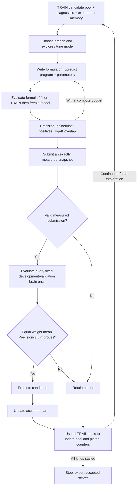

# Fixed-pool scorer evolution

`proofreader_evolve` has one workflow: improve native-label Precision@K on the
exact candidate pools of selected frozen AutoDiscovery detectors. It does not
edit graphs, expand candidates, retrain detectors or deploy scorers automatically.

## Pipeline




1. Select one frozen merge-junction detector and one split-site detector from
   `autodiscovery-application/`, with their matching fitted joblibs.
2. Prepare tables from matching `cache/dataset_cache_<brain>_mcl<N>_add.pkl`
   caches. Call each detector's original universe builder and feature extractor;
   preserve candidate identity and split occurrences without extra enumeration caps.
   Enable only the native analysis groups owning columns in that fitted model's
   `feature_order` (including definedness columns). Shared groups remain intact;
   unknown or ambiguous feature ownership fails instead of enabling all groups.
3. Store predictor features plus `detector_score` separately from candidate
   identities and evaluator labels. Validate table, source and model provenance.
4. Evaluate the seed scorer and retain a separate frozen-detector baseline.
5. In each generation, choose a retained TRAIN branch and an `explore` or `tune`
   mode. A fresh LLM session edits one kind's `scorer.py`, `training.py`, `rules.md`,
   and `proposal.json`; the other kind stays at its accepted version. Active kinds
   alternate unless `--target-kind` is specified. Stratified TRAIN diagnostics
   and memory guide formula design. A literal numeric `PARAMS` dictionary separates
   constants from the formula. `evaluate_train({})` measures one candidate;
   `search_parameters({})` measures the proposed grid and restores its best
   successful candidate by TRAIN mean precision. Tune mode
   enforces an unchanged formula AST. The default budget is 8 new configurations,
   plus one repair after the first execution error. Proposal-format errors and
   cache hits spend no scoring budget (but still use SDK turns).
   Every attempt saves code, proposal, parameters, metrics, Top-K changes and
   counterexamples. `restore_candidate` recovers measured code by short ID;
   the final submission must exactly match a successful measurement.
6. Evaluate the final measured candidate on every selected development-validation
   brain. Average merge/split Precision@K within each brain, then average the
   brains equally. Promote only if this mean exceeds the accepted parent's mean
   by more than `--precision-margin`. Individual brain/kind regressions and TRAIN
   regressions are allowed. Reject invalid, nondeterministic or timed-out scorers;
   a failure on any selected brain rejects the candidate, not that brain.
7. Independently retain up to 5 TRAIN branches per kind within 0.02 absolute
   precision of its TRAIN champion, deduplicating Top-K membership and preferring
   different formula structures. A validation rejection does not remove an
   exploratory branch. Normally tune the champion; explore every third measured
   round per kind and whenever the selected seed lacks numeric parameters.
   Two measured rounds without a new TRAIN best force formula exploration from
   an alternative branch when available. Two unsuccessful forced explorations
   pause that kind; all kinds paused ends the run. Cache-only rounds and failed
   measurements do not advance plateau counters. Save branch selection, search
   mode, counters, stop reason and the accepted scorer.

The exploration parent and the accepted parent are distinct roles. The pool and
scheduler read TRAIN only. The validation-mean promotion gate compares against the
accepted parent's full-precision measurements. TRAIN feedback's `parent_train`
also refers to that accepted parent; `search_plan.json` identifies the branch.

### Search controls and proposal example

Defaults: `--train-evaluations-per-generation 8 --candidate-pool-size 5
--candidate-score-tolerance 0.02 --plateau-patience 2 --exploration-patience 2
--explore-every 3`. `--no-early-stop` continues searching until the generation limit.
The tolerance is an absolute Precision@K difference, not a relative percentage.

For a scorer using `PARAMS = {'weight': 1.0}` and referencing `PARAMS['weight']`:

```json
{
  "hypothesis": "Geometry improves the ordering near K",
  "strategy": "Blend the detector score with a normalized geometry feature",
  "family": "geometry-blend",
  "parameter_grid": {"weight": [0.5, 1.0, 2.0]}
}
```

Write this to `proposal.json`, then call `search_parameters({})`. Each distinct
uncached configuration consumes one evaluation. Unknown keys, nonfinite values,
duplicate JSON fields and grids exceeding the remaining budget fail before any
scorer execution. Grid search accepts at most 64 combinations. Restore using
`restore_candidate({"candidate_id":"gen002/attempt001"})`, `"parent"`, or `"best"`.
In tune mode restoration must preserve the assigned formula.

### Agent-authored model training

The agent edits `training.py` with `fit(X_train, y_train, artifact_dir, params)`
and `predict(X, artifact_dir, params)`, chooses any model and preprocessing
supported by installed CPU libraries, and supplies arbitrary JSON settings in
`proposal.json.classifier.parameters`. There is no model whitelist, algorithm-
specific hyperparameter bound or mandatory NumPy conversion. Custom classes,
ensembles, neural models and TRAIN-only internal CV can live in the same program.
See [classifier_guide.md](artifacts/classifier_guide.md) for the full interface.

`train_classifier({})` invokes fit in a fresh isolated worker with all TRAIN
predictors/labels. The host records source, parameters, provenance, logs and
hashes of the opaque model files. Prediction runs in another isolated process
with the same source/parameters, read-only model files and feature-only inputs.
No validation labels enter either worker. All generated Python, dependency
imports and model deserialization run after Landlock filesystem restrictions
and a seccomp syscall allowlist. Missing kernel/library support fails closed.
This enforces data access, not the mathematical semantics of arbitrary code;
applying frozen preprocessing is part of the predict contract.

One fit plus TRAIN scoring consumes one of the eight shared configurations;
failed fits cost one and get no metric. The cache includes the complete program
and parameters within the fixed TRAIN run. In tune mode the program AST and
nonnumeric parameters stay fixed; numeric parameters are refitted. Explore mode
permits any new program or a return to formulas. Default limits are 300 seconds,
8192 MiB and one numerical thread, configured by `--classifier-time-budget`,
`--classifier-memory-mb`, `--classifier-threads`. Model files are bounded to
128 MiB / 256 regular files. No GPU, network, installation or child processes.
`model_environment.json` lists installed packages and limits. The agent chooses
seeds and can print diagnostic/CV metrics; the last 8 KB of worker output is
returned, and the full bounded log is preserved.

The outer TRAIN metric remains **in-sample resubstitution**. Every valid, measured
final candidate receives one outer evaluation across the fixed validation brains;
TRAIN gain is not a prerequisite. Exploration/pool/plateau use TRAIN only, while
promotion uses the validation mean only. Final submission and
cache reuse check the code/configuration and artifact hashes. Resume requires
`best_scorer.py` plus `model_artifacts/`, or `--start-from-artifacts` pointing to
that store; no refit occurs. Models fitted on requested validation brains are
rejected. Legacy NumPy exports remain readable for resume.

## Commands

Use panda on an allocated compute node for table preparation:

```bash
python proofreader_evolve/prepare_feature_tables.py --brains 794495 789202 794491 794493 802449 --mcl 100
python -m proofreader_evolve.cli.preflight --brains 794495 789202 794491 794493 802449 --mcl 100
python -m proofreader_evolve.cli.run_evolution \
  --train-brains 794495 --validation-brains auto \
  --merge-k 100 --split-k 100 --generations 5
```

Defaults are TRAIN `794495` and automatic validation discovery. At startup, scan
local matching-MCL `_add.pkl` caches, exclude TRAIN and detector-fitted brains,
and load each remaining brain's exact prepared merge/split tables. Missing inputs
are logged and skipped; integrity errors or empty pools abort. At least one
validation brain is required. Save candidates, exclusions and the resolved split
to `dataset_split.json` and `manifest.json`, then freeze the selected banks for
all generations. New tables arriving during a run only affect the next run.
An explicit comma-separated `--validation-brains 789202,794491,794493,802449`
requires every requested brain to be ready; nothing is silently excluded.

Preparation can scan whole graphs; it is not a smoke test. One brain is loaded
per subprocess, and the first failure stops the launcher. Matching tables are
reused. Evolution itself requires prepared tables and never builds them.
The preparation launcher accepts `--threads all` to use the process's available
CPU count, respecting CPU affinity, for numerical-library threads. It logs the
requested setting, resolved thread count and available CPUs. The default is 1;
this setting does not parallelize serial Python feature loops.
For other detector directories, use `cli.precompute_error_scores` and pass the
same `--merge-dir`/`--split-dir` selections to preflight and evolution.

`--generations 0` evaluates the seed/baseline without calling an LLM. Preflight
does not test API access unless explicitly given `--check-api`; that probe does
not validate the full reviser SDK/tool workflow. Live evolution requires
`ANTHROPIC_API_KEY`.

## Scorer contract

`score_candidates(features, ctx)` receives a copied feature-only DataFrame;
`ctx` contains only `kind`. Return one finite, deterministic score per row in
the original order. No candidate IDs, GT labels or brain identifiers are supplied
to the scorer. TRAIN feedback may contain bounded anonymous labeled examples;
validation examples and measurements are not provided to the reviser.

The harness takes exactly `min(K, pool size)` per brain/kind, with stable
candidate-ID tie breaking. Each brain must have the same candidate kinds. Average
kind precision within each brain, then average brains equally, independent of
pool size or positive counts. This equals the cell macro average for complete
merge/split tables. Pool identity,
labels, budgets, frozen weights and feature definitions cannot change within a
run. Returning fewer rows cannot improve precision. Ties do not pass the gate.

## Modules and artifacts

- `cli/run_evolution.py`: lightweight entrypoint to `run_precision_evolution.py`.
- `cli/precompute_error_scores.py`, `harness/native_pool.py`: native tables,
  frozen detector inference and provenance.
- `harness/dataset.py`: trusted cache loading and brain/MCL checks only.
- `harness/fixed_pool_scoring.py`: ranking evaluation and acceptance.
- `dataset_split.json`, manifest `promotion_gate`: resolved datasets, exclusions,
  equal-weight aggregation and the versioned mean-validation-only promotion rule.
- `harness/isolated_scoring.py`, `scorer_worker.py`: feature-only subprocess
  transport, seccomp execution boundary and resource limits.
- `harness/scorer_components.py`: host-owned component dispatch and scorer export.
- `harness/train_experiments.py`: budgeted TRAIN tools, snapshots, deduplication
  and searchable experiment archive across all generations in the current run.
- `harness/search_proposals.py`: proposal validation, formula fingerprints and
  AST-based numeric substitution without executing generated code.
- `harness/candidate_pool.py`: diverse TRAIN branch retention and per-kind plateau
  scheduling, independent of the validation ledger.
- `harness/classifier_contract.py`: program/configuration validation and hashed
  artifact manifests; no model deserialization in the host.
- `harness/classifier_training.py`: TRAIN transport, fit snapshots and provenance.
- `harness/classifier_train_worker.py`, `model_execution.py`, `model_sandbox.py`:
  isolated agent fit/predict, file transport and resource controls.
- `harness/legacy_classifier.py`, `frozen_classifier_runtime.py`: read compatibility
  for earlier self-contained numeric model exports; not the new fitting path.
- `harness/training_diagnostics.py`, `train_feedback.py`: stratified examples,
  whole-pool statistics, parent-relative ranking changes and bounded feedback.
- `harness/reviser_session.py`, `reviser_access.py`: SDK configuration, exact
  file-tool allowlists and explicit TRAIN tool permissions.
- `harness/run_records.py`, `collect_run.py`, `plotting/`: precision-only
  record reading, summaries and plots.

Runs save `manifest.json`, `baseline.json`, `seed.json`, `final.json`,
`best_scorer.py`, `ledger.jsonl`, `tool_audit.jsonl`, `candidate_pool.json`,
`search_summary.json`, and per-generation `scorer.py`, `rules.md`, `proposal.json`,
`search_plan.json`, `candidate_pool.json`, `train_feedback.json`, `evaluation.json`.
`train_experiments.jsonl` archives all TRAIN attempts. Each generation's
`experiments/attemptNNN/` keeps the proposal, component and combined source,
diff, numeric parameters, result and successful evaluation diagnostics. Each
`parameter_searches/batchNNN/` saves the fixed formula, grid and results table.
`classifier_searches/batchNNN/` records model configurations and outcomes;
`classifier_fits/fitNNN/` keeps requests, TRAIN fingerprints, worker logs, model.json,
training.py, scorer manifest and training_summary.json, or a failed-fit result.
Run-level `model_artifacts/<digest>/` stores the model files referenced by those
manifests. Every generation also saves training.py and model_environment.json. Successful
experiment snapshots include training_summary.json. The raw TRAIN matrices are
temporary and inaccessible through the reviser's read allowlist.
`parent_scorer.py` is the chosen exploration branch; `accepted_scorer.py` and
`parent_combined_scorer.py` snapshot the accepted comparator. The reviser restores
immutable component snapshots by ID through a TRAIN tool and cannot overwrite
them or read validation-containing ledgers/trajectories. Full observable SDK actions, tool
results and summaries are saved in `trajectory.txt` and `trajectory.jsonl`.
Costs are summed per fresh session; missing amounts remain unknown. Missing
evaluations are never converted into zero or retained-parent measurements.

## Removed workflow and retained data

The `--objective structural_repair` workflow and its compatibility exports,
graph-edit scoring, repair-site enumeration, detector query adapter, image repair
helpers, seeds, priors, structural tests and analysis notebooks were removed.
The CLI no longer accepts `--objective`, `--candidate-mode`, repair enumeration
flags or the old `--test-brains` alias. Use `--validation-brains`.

The unused `prepared_cache/` directory and its three historical graph-edit
pickles have been deleted. The unreferenced `harness/policy_runtime.py` timeout
helper, its dedicated tests and bytecode for removed modules were also deleted.
Current scoring and model workers retain their own timeout enforcement.

Historical `runs/` and `log/`, current feature tables and labeled source caches
are retained. Current summaries and plots accept precision runs only; old
executable analysis requires its original code version. Six orphaned notebook
checkpoints under `notebooks/.ipynb_checkpoints/` are retained as historical
backups, not current workflow entrypoints.

## Integrity and interpretation limits

Source fingerprints are strict, so this cleanup can invalidate existing native
tables even though the detector candidate pool is unchanged. Rebuild if preflight
requests it; do not rename table directories or bypass provenance checks.
Source caches, detector scripts and joblibs are never rewritten by preparation.

The default models were fitted on 794495. Training/validation brains must be
disjoint, and a detector-fitted brain cannot serve as validation. Repeated
validation guides selection; it is not an untouched final test. Sparse native
annotations are not exhaustive biological truth, and ranking gains do not prove
safe graph repair. The SDK file guard controls revision tools; generated Python
executes in a separate Linux worker. It receives numeric features and kind only,
with no inherited credentials or parent file descriptors. After loading NumPy,
pandas and the input, a seccomp allowlist denies file opens, network operations,
process creation and filesystem mutation. Wall time, CPU time, address space
(8 GiB) and output size are bounded. Missing `libseccomp.so.2` or failed filter
installation fails closed. Arbitrary third-party imports after filtering are
unsupported for hand-written formulas. The model-program path instead uses
Landlock to permit installed-library reads, stage-specific inputs and artifact
access, plus seccomp to permit CPU threads while denying network/child processes.
Its fit worker sees TRAIN labels; its prediction worker sees no labels and cannot
write model files. This does not establish biological validity or prevent overfitting
the visible TRAIN diagnostics.

## Regression tests

```bash
python -m unittest discover -s proofreader_evolve/tests -t .
```

Tests use tiny fixtures, arbitrary model artifacts, sandbox-boundary probes, mocked evolution and local
plots. They do not load full brains or call a live LLM.
