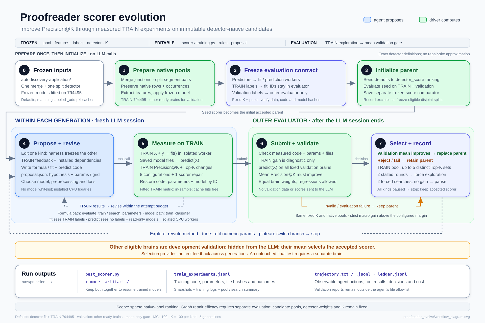
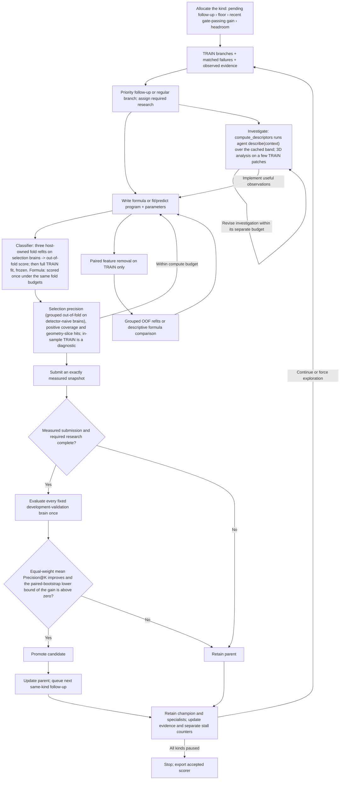

# Fixed-pool scorer evolution

`proofreader_evolve` has one workflow: improve native-label Precision@K on the
exact candidate pools of selected frozen AutoDiscovery detectors. It does not
edit graphs, expand candidates, retrain detectors or deploy scorers automatically.

## Pipeline



A one-page visual overview (frozen inputs, the generation loop, outputs and the
blindness boundary) is in [workflow_overview.svg](workflow_overview.svg).



1. Select one frozen merge-junction detector and one split-site detector from
   `autodiscovery-application/`, with their matching fitted joblibs.
2. Prepare tables from matching `cache/dataset_cache_<brain>_mcl<N>_add.pkl`
   caches. Call each detector's original universe builder and feature extractor;
   preserve candidate identity and split occurrences without extra enumeration caps.
   Enable only the native analysis groups owning columns in that fitted model's
   `feature_order` (including definedness columns). Shared groups remain intact;
   unknown or ambiguous feature ownership fails instead of enabling all groups.
3. Store predictor features plus `detector_score` separately from candidate
   identities and evaluator labels. Validate table, source and model provenance.
4. Evaluate the seed scorer and retain a separate frozen-detector baseline.
5. In each generation, choose a retained TRAIN branch and an `explore` or `tune`
   mode. A fresh LLM session edits one kind's `scorer.py`, `training.py`, `rules.md`,
   and `proposal.json`, plus `analysis.py` and `analysis_request.json` for direct
   TRAIN 3D investigation; the other kind stays at its accepted version. The kind
   is chosen per generation by the adaptive allocator (pending follow-up, a floor
   of one revision per `--kind-floor-every` generations, recent gate-passing gain,
   then remaining headroom; `--kind-schedule alternate` restores strict rotation)
   unless `--target-kind` is specified. Stratified TRAIN diagnostics
   and memory guide formula design. A literal numeric `PARAMS` dictionary separates
   constants from the formula. `evaluate_train({})` measures one candidate;
   `search_parameters({})` measures the proposed grid and restores its best
   successful candidate by the official selection score (grouped out-of-fold
   precision on the selection brains under `grouped_oof`; see the v13 section
   below). With `--context-cache`, `compute_descriptors` runs agent-written
   `describe(context)` over the cached candidate band and registers `bank_agent_*`
   predictors (v14 section below). Tune mode enforces an unchanged formula AST. The default budget is 8 evaluation units,
   shared by new configurations and optional feature-diagnostic fold fits,
   plus one repair after the first execution error. Proposal-format errors and
   cache hits spend no scoring budget (but still use SDK turns).
   Every attempt saves code, proposal, parameters, metrics, Top-K changes and
   counterexamples. `restore_candidate` recovers measured code by short ID;
   the final submission must exactly match a successful measurement.
6. Once required research/follow-up work is complete, evaluate the final measured
   candidate on every selected development-validation
   brain. Average merge/split Precision@K within each brain, then average the
   brains equally. Promote only if this mean exceeds the accepted parent's mean
   by more than `--precision-margin` and, in the default `--promotion-gate bootstrap`
   mode, the lower bound of the paired row-resampling interval of that gain is
   above zero (`--bootstrap-draws`, `--bootstrap-alpha`). Individual brain/kind
   regressions and TRAIN regressions are allowed. Reject invalid, nondeterministic or timed-out scorers;
   a failure on any selected brain rejects the candidate, not that brain.
7. Independently retain up to 5 TRAIN branches per kind. Keep the overall TRAIN
   champion first. Prefer specialists that lead fixed geometry slices or recover
   positive candidates missed by already retained branches, even if their mean
   precision is more than 0.02 below the champion. Fill remaining slots with
   near-best distinct Top-K alternatives, preferring different formula structures.
   Compare all successful trials in a generation together. A validation rejection
   does not remove an exploratory branch. Separately pin one reference per kind
   from the initial seed/current accepted component. It cannot be evicted by TRAIN
   selection and consumes no TRAIN archive slot. A new promoted component takes
   priority in the next same-kind generation, with at most one retry to produce
   fresh evidence from that workspace branch. Seeds and unchanged references do
   not enqueue this follow-up. Otherwise, every third scheduled generation
   per kind explores that reference, with independent merge/split counters.
   Cache-only and failed generations advance this cadence, not plateau measurements.
   Other rounds use the TRAIN champion/alternative scheduler; `--explore-every`
   counts newly measured non-reference rounds so specialist turns are not displaced.
   Two measured rounds without progress force exploration from an alternative
   branch when available. Progress means a new selection-score best (grouped
   out-of-fold precision under v13), a previously uncovered positive retained in
   the pool, or a new historical slice-hit best.
   Two unsuccessful forced explorations can pause that kind after a generation
   assigned to its current reference produces a new successful TRAIN measurement.
   Promotion replaces the reference and resets that kind's stagnation counters.
   All kinds paused ends the run. Cache-only rounds and failed measurements do
   not advance measured-progress counters or satisfy the reference requirement.
   Independently, two completed same-kind rounds without fresh measurements force
   an investigation. Performance plateaus also require a new measured comparison.
   Repeated observations and cached restores do not fulfill it; execution blocks
   are counted separately. Incomplete work skips validation and retains the policy.
   Default pauses also apply after two incomplete investigations or two consecutive
   execution-blocked rounds, with explicit reasons; these are not scientific rejection.

Feature-discovery rounds can additionally use matched failures, direct 3D analysis,
paired feature ablations and hypothesis-aware scheduling as described below.
Ablation evaluations share the scoring budget; geometry inspection, 3D analysis
and optional 2D previews each have separate allowances. Exploration tools do not
change the outer promotion gate.

The exploration parent and the accepted parent are distinct roles. TRAIN archive
selection reads TRAIN only; the reference identity comes from the host's promotion
decision and therefore carries indirect development-validation feedback. Only
TRAIN measurements and diagnostics are exposed in pool/plan files; no heldout
data, scores or decision reasons enter them. The promotion gate compares against the
accepted parent's full-precision measurements. TRAIN feedback's `parent_train`
also refers to that accepted parent; `search_plan.json` identifies the branch.

### Adaptive kind allocation (2026-10-05 / v16)

Version `adaptive-kind-allocation-v16` changes which kind a generation revises;
scoring, selection, the promotion gate and the per-kind exploration logic are
unchanged. Motivation: in `precision_20261005_114814_zxsbw5pj` strict rotation
spent five of ten generations on merge for a total validation gain of 0.0065
while five split generations gained 0.048. Merge had almost no room: on the
accepted scorer the equal-brain mean of `min(positives, K) / K - precision` was
0.017 for merge (789202 has 62 merge positives, a cap of 0.031 at K = 2000)
against 0.66 for split.

- **Inputs (`harness/kind_schedule.py`, host-side).** Per kind: headroom, the
  equal-brain mean remaining precision on the accepted parent's development-
  validation cells; momentum, the mean gate-passing validation gain over the
  kind's last two scheduled generations (rejected or failed generations count as
  zero); generations since the kind was last scheduled; pause and pending state
  from the candidate pool.
- **Rules, in order.** (1) a kind with a pending promotion follow-up or pending
  investigation; (2) floor: a kind not revised in the last `floor_every - 1`
  generations (`--kind-floor-every`, default 4); (3) momentum: the largest
  momentum among unsaturated kinds; (4) headroom: the largest headroom. A kind
  whose headroom is below half a Top-K hit is saturated and only reaches a
  generation through rules 1 and 2.
- **Wiring.** `CandidatePool.next_plan(order=...)` takes the ordered kinds and
  plans the first non-paused one; with `--kind-schedule alternate` (or a single
  kind) the previous rotation is used. The default `--generations` is now 15; the
  recommended run uses 20 with early stopping unchanged.
- **Records and blindness.** The ledger row and run trajectory carry
  `kind_allocation` (rule, chosen kind, per-kind headroom, momentum, generations
  since, saturation); the manifest records `kind_schedule`. The agent-visible
  `search_plan.json` gains only `allocation_rule`, a rule name; no headroom or
  gain number reaches an agent-visible file, and the TRAIN-archive guard tests
  still apply.
- **Caveat.** Momentum feeds development-validation outcomes back into
  scheduling, as promotion follow-ups already did; it does not make development
  validation an untouched test. The allocation is faithful to the equal-kind
  mean objective: when merge cannot move the mean by more than 0.017, more merge
  generations cannot raise the score; a run that values merge quality for its
  own sake can lower `--kind-floor-every` or use `--target-kind merge`.

Tests: `tests/test_kind_schedule.py`: rule-level cases (headroom, momentum with
rejections as zero, floor, pending follow-up, saturation, pauses) and driver runs
on a two-kind fixture where merge is saturated at the seed: adaptive scheduling
yields split, split, split, merge with rules headroom, pending_followup,
momentum, floor; strict rotation alternates; agent-visible files contain no
allocation numbers.

### Bootstrap promotion gate (2026-10-05 / v15)

Version `bootstrap-promotion-gate-v15` changes only the outer promotion decision.
Motivation: in run `precision_20261005_114814_zxsbw5pj` generations 1, 7 and 9
were promoted on mean validation gains of +0.0003, +0.00008 and +0.00008 whose
95% paired-bootstrap intervals contained zero; generation 7 also carried a
negative TRAIN ablation (-0.004) and still replaced the parent, and every
promotion scheduled a same-kind follow-up generation.

- **Rule (`fixed_pool_scoring.bootstrap_acceptance`).** The candidate must beat
  the accepted parent's equal-brain mean Precision@K by more than
  `--precision-margin` (the unchanged point test with its benchmark identity
  checks) AND the lower bound of the two-sided (1 - alpha) paired
  Poisson-bootstrap interval of that mean delta must exceed zero
  (`--bootstrap-alpha`, default 0.05; `--bootstrap-draws`, default 1000; seed =
  generation). A missing or failed interval never promotes.
- **Modes.** `--promotion-gate bootstrap` (default) or `margin`, the previous
  point-estimate rule with the interval logged only. Tiny-fixture tests use
  `margin`, because a resampled 3-row pool cannot separate any gain from zero.
- **Records.** `validation_gate` carries `mode`, `version`
  (`mean-validation-bootstrap-v1` or `mean-validation-precision-v1`),
  `point_gate`, `bootstrap_gate` (`alpha`, `lower_bound`, `upper_bound`,
  `passed`, `binding`) and the full `paired_bootstrap`, which now reports
  `alpha`, `macro_delta_ci` and per-cell `delta_ci` next to the legacy
  `macro_delta_ci95`. The manifest's `promotion_gate.mode` and
  `promotion_gate.bootstrap.affects_decision` state the rule in force;
  `search_version` is `bootstrap-promotion-gate-v15`.
- **Consequences.** A candidate rejected by the interval keeps the existing
  rejection semantics: it stays in the TRAIN archive when its TRAIN score
  qualifies, never becomes the accepted parent, and schedules no promotion
  follow-up. The interval measures row-resampling noise on the fixed pools only;
  it does not turn development validation into an untouched test, and it does
  not model neuron-level dependence or scorer nondeterminism.
- **Cost.** 1,000 draws over six synthetic cells totalling 425,142 rows took
  21 s on n257 (Python loop over draws; rank orders are precomputed once).

Tests: `tests/test_bootstrap_gate.py`: on a 4,000-row synthetic pool one extra
Top-K hit (+1/K) passes the margin gate and fails the bootstrap gate, a clear
gain passes, missing or mismatched intervals fail closed, and driver runs in
both modes record the new fields and schedule no follow-up after a bootstrap
rejection.

### Agent descriptors over a cached candidate band (2026-10-04 / v14)

Version `agent-descriptor-compute-v14` changes how the agent reaches fragment
geometry and pixels, not how candidates are selected or promoted. Two measured
facts motivate it: in `precision_20261003_190054_96ng6ehh` the agent ran 3D
analysis three times on twelve sites and never scored an image quantity, and
every descriptor it wrote (about 56 across two runs) was computed on at most
16,000 rows under a per-evaluation time budget and then discarded. The cause is
structural: image and local-geometry features could only enter through
`LOCAL_IMAGE`/`LOCAL_CONTEXT` declarations extracted inside each evaluation,
with cold cloud reads, per-call byte and time budgets, caches keyed by the whole
program hash, and no step that shows a quantity's distribution before it is
committed to a scorer.

- **Context cache (`harness/context_cache.py`, `cli/precompute_context_cache.py`).**
  Once per brain and kind, the host stores the raw context of the top
  detector-ranked band (default 20,000 rows, ties by candidate key): the
  fragment neighbourhood at 50 um / 256 nodes with the existing whitelisted
  fields, and image patches at level 1 / 30 um and level 0 / 16 um, both for the
  whole band (level 0 covered only the first 4,000 rows until 2026-10-05; see the
  level-0 extension entry in the evidence log). Entries live under
  `proofreader_evolve/context_cache/<brain>/<kind>/<pool_sha256>/`, outside the
  hashed feature-table directories, and bind to the pool, `features.pkl`,
  source-cache and image identities. No labels, GT, absolute coordinates or
  persistent IDs are stored; failed patch reads are recorded as unavailable
  rows. Nothing in the cache is a feature. `precompute_context_cache --extend-tier
  level0` grows a tier of complete entries in place (`ContextCacheBuilder.extend_tier`):
  leading full chunks are kept, the trailing partial chunk is rebuilt, new chunks are
  appended, the tier directory is swapped atomically and the manifest rewritten last;
  fragment node positions come from the cached neighbourhoods and the reader's
  anchor midpoint. Descriptor-bank identities include only the tier a descriptor
  reads, so extending level 0 leaves cached level-1 and geometry results valid.
- **Descriptor contract (`harness/descriptor_contract.py`).** The agent edits
  `descriptor.py`: a literal `DESCRIPTOR = {kind, inputs, image_tier,
  feature_names}` and `describe(context)` receiving the same context schema as
  `analyze(context)`. At most 16 names per submission; results register as
  `bank_agent_<name>` columns.
- **Pool-scale compute (`harness/descriptor_runs.py`, worker mode `describe`).**
  `compute_descriptors({"scope"})` runs describe over `pilot` (512 rows),
  `boundary` (2,000 rows each side of K) or `all_cached` for every TRAIN brain in
  up to `--descriptor-workers` (default: available CPUs minus 2) single-threaded
  sandboxed workers, 256 rows per batch, under one wall deadline
  (`--descriptor-wall-seconds`, default 1800; `--descriptor-generation-wall-seconds`,
  default 5400). Each row is evaluated twice and must agree; infinities fail the
  call; a failure in any batch registers nothing. Results are cached in
  `descriptor_bank/` by descriptor code hash, band identity and scope, so repeats
  cost nothing across generations and runs. The reply carries label-conditional
  TRAIN quartiles, finite fractions and coverage; `plan_descriptor_run({})` times
  64 rows first and extrapolates. One uncached call costs one evaluation unit.
- **Registration and use.** Registered columns join the in-memory predictor
  frame of every TRAIN table, so `feature_statistics.json` (recomputed when the
  registry changes), formulas, `training.py` programs and
  `evaluate_feature_ablation` see them without any declaration.
  `bank_context_available` marks cached rows; rows outside the band are NaN.
  Frozen model manifests now record their exact input `columns`, prediction
  reindexes to them, and a candidate that references unregistered descriptor
  columns is rejected before validation.
- **Inference on other brains.** At submission the host computes every
  referenced descriptor on the validation brains' cached contexts (cached by
  code hash) before the outer evaluation; those values never enter feedback.
  Accepted scorers that reference descriptors save `descriptors.json` (code and
  specs) beside `best_scorer.py`; a resumed run restores and recomputes them
  before the seed evaluation and refuses to start without `--context-cache`.
- **Agent surface.** `descriptor.py`, `descriptor_guide.md` and
  `artifacts/descriptors/` (readable examples ported from earlier agent code,
  with the outcome each one measured; not precomputed columns) are added to each
  generation when a context cache is attached. `model_environment.json` lists
  workers, wall budgets, cached rows and tiers. Feedback prunes all-missing
  columns before shrinking examples and allows 96 KB (48 KB before 2026-10-05).

Without `--context-cache` the tools are not offered and the run behaves as v13,
which is the attribution control. The selection protocol, promotion gate, K,
candidate pool and sandbox boundaries are unchanged. Pool-scale label-conditional
statistics make descriptor search against TRAIN labels cheap; the grouped
out-of-fold selection and the outer gate remain the guards.

### Grouped out-of-fold selection on detector-naive brains (2026-10-03 / v13)

Version `grouped-oof-selection-v13` changes how TRAIN branches are ranked, not
how candidates are promoted. It responds to two measured failure modes in
`precision_20261003_004137_sogl3h0d`: the split champion the scheduler kept
returning to reached 0.711 in-sample TRAIN precision and the worst validation of
the run, and TRAIN brain 794495 is the brain both frozen detectors were fitted
on, so every in-sample TRAIN measurement inherits the detector's own optimism.
That run motivates the revision; it does not validate it.

- **Brain roles.** `--train-brains` may list several brains. Selection brains
  (`--selection-brains`, default: every TRAIN brain the frozen detectors were
  not fitted on) provide the official selection score. Remaining TRAIN brains
  are auxiliary: their rows join every fitting set, they are never held out, and
  their in-sample scores are diagnostics only. Validation brains are unchanged
  and still include every eligible non-TRAIN brain (794491 stays in the gate).
  A selection brain that appears in the detectors' training provenance, or TRAIN
  tables without provenance, abort the run; `--selection-protocol in_sample`
  restores the historical full-pool in-sample ranking for attribution runs.
  Roles are recorded in `dataset_split.json`, `manifest.json` and preflight.
- **Fold protocol.** `internal_validation.grouped_folds(selection_brains=...)`
  partitions only selection-brain groups (merge: fragment; split: 500 um blocks
  with fragment purging) into three fixed, label-independent folds. Each
  classifier configuration is refit by the host once per fold on fitting rows
  plus all auxiliary rows (`fit_rows`, `random_seed=fold`), predicts its held
  rows, and only then is fit on all permitted TRAIN rows to produce the frozen
  candidate. Fold models stay under `classifier_fits/fitNNN/selection_folds/`
  and never enter `model_artifacts/`. The fit worker receives an optional
  label-free `groups` keyword (source brain per training row) when `fit`
  declares it.
- **Official score.** `selection_protocol.partitioned_rank_metrics` ranks
  out-of-fold scores inside each fold with largest-remainder fold budgets that
  sum to K and reports summed TP over K as `grouped_cv_precision`; fold scores
  are never pooled into one global ranking because fold models can differ in
  scale. Formulas are scored once under the same partition and budgets and are
  labelled descriptive. The score becomes the entry's `target_precision`, so the
  candidate pool, tune/grid winners (`_best`), specialist coverage
  (`TrainingCoverage` on selection brains), hypothesis evidence and stall
  counters all use it. `in_sample_precision`, `train` and `train_gate` remain as
  diagnostics; a `selection_gate` records the selection delta against the
  accepted parent (never required for promotion). Each snapshot saves
  `selection_evaluation.json` and `selection_state.npz`; cached restores reuse
  them and spend no fit.
- **Feedback.** `train_feedback.json` (`stratified-train-v4`) takes examples,
  `ranking_delta` and matched failure cases from the accepted parent's selection
  measurement on selection brains, and shows `parent_train` in-sample metrics
  for all TRAIN brains as diagnostics only. `selection_protocol` in the feedback
  describes the partition, fold budgets and brain roles.
- **Charging.** One classifier configuration costs one evaluation unit, fold
  refits plus the full fit included. A paired feature ablation costs one unit per
  arm (two per comparison, previously six); classifier ablations share the
  selection partition and score only selection brains with the same partitioned
  budgets. Exhausted budgets stop new attempts; nothing falls back to in-sample
  scoring.
- **Baseline diagnostic.** With auxiliary brains present, the host refits
  `artifacts/training.py` per fold on selection rows only and on selection plus
  auxiliary rows and records both official scores in `auxiliary_ablation.json`
  and `baseline.json` (`--skip-auxiliary-ablation` disables it). It informs
  whether auxiliary rows help the seed template; it ranks no branch.
- **Promotion logging.** The gate formula, K and margin are unchanged. Each
  promotion decision additionally records a paired Poisson-bootstrap interval of
  the equal-weight validation delta (`validation_gate.paired_bootstrap`,
  `--bootstrap-draws`, default 200; logging only) so a later revision can set a
  margin from data. Validation score vectors stay in host memory; only intervals
  are written. Superseded on 2026-10-05: the interval is binding by default (see
  the bootstrap promotion gate section); `--promotion-gate margin` restores this
  logging-only behaviour.

Deviation from the written plan: the full-TRAIN fit runs for every classifier
configuration rather than only at submission, because the snapshot/restore
machinery, immutable measured components and `scorer.py` binding all identify a
candidate by its frozen source. The extra cost is one full fit per non-submitted
configuration; selection never reads the full-fit model. The selection score is
repeatedly queried by the reviser and is therefore a development signal, not an
unbiased generalization estimate; outer validation remains the only promotion
authority.

### Measured investigations and immediate follow-ups (2026-10-03)

Version `measured-investigation-followup-v12` addresses two observed behaviors in
`precision_20261002_181737_h5b9t20l`: generations repeatedly deferred image
investigation, and the next split generation did not start from the component
promoted in generation 8. That historical run motivates the change; it does not
validate the revised workflow.

- `ResearchEvidence` records actual TRAIN tool executions, source category,
  candidate/input identity, method fingerprint, observed workspace checkpoint,
  cached/reused status, result artifact and outcome. Geometry and image previews
  are observations. Scores, numerical 3D analyses and paired ablations are
  measurements. Comments, docstrings and formatting are removed from method
  fingerprints; identical recorded input/method identities are reused. Negative
  results count as evidence. Execution verification does not prove semantic
  novelty, useful information gain or improved ranking.
- Two same-kind rounds without fresh measurements trigger a required comparison;
  performance/hypothesis plateaus do so as well. If registered TRAIN images are
  available and have not been compared, require image evidence. The reviser chooses
  a numerical 3D analysis on at least two distinct candidate handles with valid
  pixels, or a paired ablation removing all image inputs. Otherwise any fresh
  paired feature ablation or 3D comparison can complete the assignment. Empty
  outputs, previews, repeated inspections, cached restores, prose and score-only
  parameter tuning cannot complete a comparison. A joint input ablation is a
  measurement but is not evidence of an isolated image contribution.
- A new promoted reference gets the next same-kind explore slot before all other
  branch choices. One fresh measurement from the assigned workspace lineage
  completes it. Cached restores follow their actual source when tracing lineage;
  restoring an unrelated candidate cannot fake descent. Seeds and unchanged
  references do not enqueue follow-ups. There are at most two reserved slots
  (initial attempt plus one retry). If a required investigation coincides, the
  comparison must be measured on that branch. Afterwards the existing three-round
  reference cadence and TRAIN champion/specialist scheduler continue.
- `research_status.json` and compact tool receipts expose live completion status.
  Incomplete required work retains the accepted policy and skips outer validation.
  The default `--exploration-patience 2` separately bounds incomplete investigations
  and consecutive execution-blocked rounds. Their pause reasons differ from
  measured stagnation. `--no-early-stop` disables these pauses, while generation,
  tool and follow-up limits still apply. Successful negative investigations can
  advance measured stagnation; IO/worker failures cannot.

The registry is `research_evidence.jsonl`; per-generation status is saved in the
ledger and human report. It does not expose validation examples, labels or scores
to the agent. The outer equal-brain mean validation gate, fixed K, candidate pools,
model flexibility and the compact report layout are unchanged. Source declarations
in hypothesis memory remain claims; `observed_sources` records actual tool evidence.

### Failure-driven feature discovery and hypothesis memory (2026-10-02)

Each generation now saves `failure_cases.json`: at most four TRAIN pairs matching
an accepted-parent missed positive with a selected label-0 candidate. Matching uses
detector score and native gap/degree, scaled by whole-pool interquartile ranges.
Near-boundary and farther missed cases are represented; the match distance is
reported. These are diagnostic examples, not balanced substitutes for the full
candidate pool. `inspect_failure_cases({})` fetches their bounded fragment
neighborhoods in one call, sharing the eight-query allowance with individual
inspection. No GT graph or external-brain inspection is added.

`proposal.json.research` optionally declares a stable `hypothesis_id`,
`failure_mode`, `information_source`, falsifiable `prediction` and
`feature_columns`. New prompts request this evidence structure while legacy
proposals remain valid. Models and feature algorithms are still agent-written.
See [the agent guide](artifacts/feature_discovery_guide.md) for the complete schema.

`evaluate_feature_ablation({})` measures full inputs against the same input schema
with the specified columns set to zero, including missing entries. The default
group is all declared local and image features plus their availability columns.
Removing `image_available` also withholds raw patches from both arms. This is
information removal, not literal column deletion. The exact same classifier
program and parameters are refit in both arms. Features constructed only inside
the learner are not automatically exposed as ablatable input columns.

Classifiers use the selection protocol's three fixed TRAIN-internal folds
(auxiliary brains join every fitting set): fragment grouping for merge,
500-um spatial blocks at native representative split anchor midpoints for split.
Any fitting row sharing a fragment with a held row is purged in each fold.
Assignment is label-independent. If grouping/purging leaves insufficient groups
or an unusable fitting class, the comparison is unavailable; there is no random
row fallback. Fit workers receive only fitting rows/labels, and prediction workers
receive held predictors, declared held-row patches and frozen artifacts.
Python/NumPy seeds match between arms;
agent overrides or other RNGs can still affect reproducibility. All original rows
receive one OOF prediction before full-pool Top-K evaluation; fold-model calibration
can differ. These adaptively reused TRAIN folds are not an independent final test.
The original detector/base features remain frozen and may already incorporate
fitting on this TRAIN brain; the OOF protocol applies to the new agent model and
its learned preprocessing, not to refitting the original detector.

Each classifier fold/arm costs one evaluation unit (six per comparison), including
prediction; formulas cost two units and report a descriptive full-TRAIN comparison,
not cross-validation of formula design. Reserve another unit to fit/score the
final full-TRAIN candidate. Successful exact repeats are cached. Failures spend
only started units and do not create a feature conclusion or extra repair allowance.
Fold models stay in diagnostic directories and cannot be submitted as candidates.
The tool leaves the current scorer untouched. No new feature-based promotion veto
is imposed: the existing outer mean-validation gate remains authoritative.

`hypothesis_memory.json` stores agent declarations separately from host evidence:
fresh configurations, repeated rankings, execution failures, exact-code feature
ablations and measured stagnation. Each generation gets a bounded relevant view;
`search_memory` also includes related hypothesis evidence. Successful feature
evidence attaches to candidates only when program and parameter hashes match.
`feature_ablations/ablationNNN/` preserves programs, proposals, identity, predictions,
fold artifacts, logs and results. The run ledger includes `feature_diagnostics`.

Two measured generations without improving a hypothesis's historical TRAIN best,
or two recent successful grouped ablations with no positive increment, lower its
scheduling priority. A stagnant champion triggers exploration; alternative-parent
selection prefers less-stagnant hypotheses before recency and score. Reference
rounds remain reserved and existing positive-coverage/slice retention remains in
place. Failures and cache-only repeats are not negative scientific observations.
The scheduler does not forbid a direction or infer universal failure from one
configuration. Distinct code/family names alone do not establish new information.

### Search controls and proposal example

Defaults: `--train-evaluations-per-generation 8 --candidate-pool-size 5
--candidate-score-tolerance 0.02 --plateau-patience 2 --exploration-patience 2
--explore-every 3`. `--no-early-stop` continues searching until the generation limit.
The tolerance is an absolute Precision@K difference for near-best fallback
branches only; complementary-positive and slice specialists are exempt.

### TRAIN specialist coverage

`train_coverage.py` matches positive identities using only the loaded TRAIN
tables and measured Top-K indices. It keeps row identities in host memory and
publishes aggregate counts, never IDs or outer evaluation data. The fixed
geometry slices are split representative gap <=25/>25 microns and merge node
degree 3/>=4, plus the whole pool for each brain/kind. Missing geometry remains
in the whole-pool slice; zero-positive slices do not select specialists.
Slice recall is positive hits within the **same global Top K** divided by the
slice's pool-positive count. It is not precision under a separate per-slice K.

After keeping the champion, greedily prefer candidates improving more slice
hit counts, then candidates adding greater equal-brain mean positive recall
relative to the retained union; mean precision, formula diversity and experiment
order break ties. A candidate finding different positives can qualify even
when its slice scores tie. Lower-scoring candidates with no complementary
positive evidence remain subject to the existing near-best tolerance.
The size limit bounds the archive; it does not guarantee keeping every specialist.

`candidate_pool.json` records `specialist_profile`, retention reasons and
positive-count comparisons with the champion and other retained branches.
`search_plan.json` names complementary candidates with restore IDs. The reviser
can inspect these methods through TRAIN restore/search tools during exploration.
Combining methods is agent-authored and must be evaluated; retaining branches
does not automatically ensemble them. Historical positive coverage and slice
maxima prevent rediscovered cases from repeatedly resetting plateau counters.
The detector-native candidate universe, original K, fitted-detector weights and
validation-mean promotion rule stay fixed.

For a scorer using `PARAMS = {'weight': 1.0}` and referencing `PARAMS['weight']`:

```json
{
  "hypothesis": "Geometry improves the ordering near K",
  "strategy": "Blend the detector score with a normalized geometry feature",
  "family": "geometry-blend",
  "parameter_grid": {"weight": [0.5, 1.0, 2.0]}
}
```

Write this to `proposal.json`, then call `search_parameters({})`. Each distinct
uncached configuration consumes one evaluation. Unknown keys, nonfinite values,
duplicate JSON fields and grids exceeding the remaining budget fail before any
scorer execution. Grid search accepts at most 64 combinations. Restore using
`restore_candidate({"candidate_id":"gen002/attempt001"})`, `"parent"`, or `"best"`.
In tune mode restoration must preserve the assigned formula.

### Agent-authored model training

The agent edits `training.py` with `fit(X_train, y_train, artifact_dir, params)`
and `predict(X, artifact_dir, params)`, chooses any model and preprocessing
supported by installed CPU libraries, and supplies arbitrary JSON settings in
`proposal.json.classifier.parameters`. There is no model whitelist, algorithm-
specific hyperparameter bound or mandatory NumPy conversion. Custom classes,
ensembles, neural models and TRAIN-only internal CV can live in the same program.
See [classifier_guide.md](artifacts/classifier_guide.md) for the full interface.

`train_classifier({})` invokes fit in a fresh isolated worker with all TRAIN
predictors/labels. The host records source, parameters, provenance, logs and
hashes of the opaque model files. Prediction runs in another isolated process
with the same source/parameters, read-only model files and label-free inputs:
predictor columns and, when requested, row-aligned raw image patches.
No validation labels enter either worker. All generated Python, dependency
imports and model deserialization run after Landlock filesystem restrictions
and a seccomp syscall allowlist. Missing kernel/library support fails closed.
This enforces data access, not the mathematical semantics of arbitrary code;
applying frozen preprocessing is part of the predict contract.

One fit plus TRAIN scoring consumes one of the eight shared configurations;
failed fits cost one and get no metric. The cache includes the complete program
and parameters within the fixed TRAIN run. In tune mode the program AST and
nonnumeric parameters stay fixed; numeric parameters are refitted. Explore mode
permits any new program or a return to formulas. Default limits are 300 seconds,
8192 MiB and one numerical thread, configured by `--classifier-time-budget`,
`--classifier-memory-mb`, `--classifier-threads`. Model files are bounded to
128 MiB / 256 regular files. No GPU, network, installation or child processes.
`model_environment.json` lists installed packages and limits. The agent chooses
seeds and can print diagnostic/CV metrics; the last 8 KB of worker output is
returned, and the full bounded log is preserved.

In-sample TRAIN metrics remain **resubstitution diagnostics**; branch selection uses
the selection protocol (v13). Every valid, measured final candidate with completed
research assignments receives one outer evaluation across the fixed validation
brains; TRAIN gain is not a prerequisite. TRAIN archive selection and progress use
the official selection score; promotion also replaces a protected reference and
resets stagnation.
Promotion uses the validation mean only. Final submission and
cache reuse check the code/configuration and artifact hashes. Resume requires
`best_scorer.py` plus `model_artifacts/`, or `--start-from-artifacts` pointing to
that store; no refit occurs. Models fitted on requested validation brains are
rejected. Legacy NumPy exports remain readable for resume.

## Commands

Use panda on an allocated compute node for table preparation:

```bash
python proofreader_evolve/prepare_feature_tables.py --brains 794495 789202 794491 794493 802449 --mcl 100
python -m proofreader_evolve.cli.preflight --brains 794495 789202 794491 794493 802449 --mcl 100
# Once per brain: cache the detector-ranked band's fragment neighbourhoods and image patches (hours; S3 reads).
python -u -m proofreader_evolve.cli.precompute_context_cache --brains 794495 802449 789202 794493 794491 --mcl 100 --readers 16
python -m proofreader_evolve.cli.preflight --brains 794495 802449 789202 794493 794491 \
  --train-brains 794495 802449 --mcl 100 --context-cache proofreader_evolve/context_cache
python -m proofreader_evolve.cli.run_evolution \
  --train-brains 794495,802449 --selection-brains 802449 \
  --validation-brains 789202,794493,794491 \
  --merge-k 2000 --split-k 2000 --generations 20 \
  --context-cache proofreader_evolve/context_cache --descriptor-workers auto
# Kinds are allocated adaptively by default; add --kind-schedule alternate for strict rotation.
# On a compute node, request the CPUs you want (e.g. srun/sbatch --cpus-per-task=32 --mem=120G);
# --descriptor-workers auto uses the granted CPUs minus 2. Omit --context-cache for the control run.
# Historical in-sample ranking for attribution (single detector-fitted TRAIN brain):
python -m proofreader_evolve.cli.run_evolution \
  --train-brains 794495 --validation-brains auto --selection-protocol in_sample \
  --merge-k 100 --split-k 100 --generations 5
```

Defaults are TRAIN `794495`, the `grouped_oof` selection protocol and automatic
validation discovery. Because 794495 is the detectors' training brain, the
default protocol needs a second, detector-naive TRAIN brain (`802449` above) or
the explicit `--selection-protocol in_sample` flag; otherwise the run aborts
before loading validation data. `--skip-auxiliary-ablation` skips the baseline
template diagnostic; `--bootstrap-draws 0` disables promotion-interval logging (only
with `--promotion-gate margin`; the default bootstrap gate needs draws). At startup, scan
local matching-MCL `_add.pkl` caches, exclude TRAIN and detector-fitted brains,
and load each remaining brain's exact prepared merge/split tables. Missing inputs
are logged and skipped; integrity errors or empty pools abort. At least one
validation brain is required. Save candidates, exclusions and the resolved split
to `dataset_split.json` and `manifest.json`, then freeze the selected banks for
all generations. New tables arriving during a run only affect the next run.
An explicit comma-separated `--validation-brains 789202,794491,794493,802449`
requires every requested brain to be ready; nothing is silently excluded.

Preparation can scan whole graphs; it is not a smoke test. One brain is loaded
per subprocess, and the first failure stops the launcher. Matching tables are
reused. Evolution itself requires prepared tables and never builds them.
The preparation launcher accepts `--threads all` to use the process's available
CPU count, respecting CPU affinity, for numerical-library threads. It logs the
requested setting, resolved thread count and available CPUs. The default is 1;
this setting does not parallelize serial Python feature loops.
For other detector directories, use `cli.precompute_error_scores` and pass the
same `--merge-dir`/`--split-dir` selections to preflight and evolution.

`--generations 0` evaluates the seed/baseline without calling an LLM. Preflight
does not test API access unless explicitly given `--check-api`; that probe does
not validate the full reviser SDK/tool workflow. Live evolution requires
`ANTHROPIC_API_KEY`.

## Scorer contract

`score_candidates(features, ctx)` receives a copied feature-only DataFrame;
`ctx` contains only `kind`. Return one finite, deterministic score per row in
the original order. No candidate IDs, GT labels or brain identifiers are supplied
to the scorer. TRAIN feedback may contain bounded labeled examples with TRAIN-only inspection handles;
validation examples and measurements are not provided to the reviser.

The harness takes exactly `min(K, pool size)` per brain/kind, with stable
candidate-ID tie breaking. Each brain must have the same candidate kinds. Average
kind precision within each brain, then average brains equally, independent of
pool size or positive counts. This equals the cell macro average for complete
merge/split tables. Pool identity,
labels, budgets, frozen weights and base feature definitions cannot change within a
run. Returning fewer rows cannot improve precision. Ties do not pass the gate.

## Local fragment context

Each generation exposes `inspect_candidate` for up to eight TRAIN-only geometry
queries. Feedback example handles resolve only against TRAIN; inspection returns
xyz-micron candidate locations and bounded local nodes, edges, radii and degrees.
Split candidates retain their native occurrence list. The matching `_add.pkl`
is loaded by the host lazily; GT and graph attributes are excluded by an explicit
geometry whitelist. Only one brain graph is retained at a time.

An optional literal `LOCAL_CONTEXT` and `extract_local_features(context)` in
scorer.py or training.py allow agent-authored geometry features. Extraction runs
after Landlock/seccomp isolation with relative geometry and base predictors;
no labels, persistent IDs, absolute coordinates, raw cache paths, artifacts or
cloud credentials are supplied. TRAIN fit gets the resulting features and labels.
Validation executes the same frozen extraction and inference, outside the agent.

By default, local extraction covers 5000 rows selected by descending detector
score per brain/kind. The agent can configure radius, node/occurrence limits,
selection predictor/direction and row budget within documented resource bounds.
All pool rows remain; missing local values and `local_context_available` identify
unselected rows. The complete source/configuration participates in candidate
identity, restoration and mode checks. Tune retains the extractor; explore may
redesign it. Run-local feature caches also bind pool, base features, original cache
identity and harness implementation. Native table preparation code is unchanged.

Inspection snapshots, feature counts/truncation/cache/timing events and worker
logs make context use auditable. The human report includes local feature metadata;
inspection snapshots remain in the run directory. See `artifacts/local_context_guide.md`.
Raw fluorescence cutouts use the separate image interface below; segmentation
label volumes and GT overlays remain excluded.

## Candidate images and registration (2026-10-02)

`inspect_candidate_image` and `inspect_failure_images` return actual MCP image
content for TRAIN candidates, with a separate allowance of eight image requests
per generation. Each preview contains XY/XZ/YZ raw MIPs, fragment overlays, and
thin slab overlays. Slab overlays clip edges and anchors to the displayed depth.
Views show native merge junctions or both split occurrence anchors. Images are
inspected by the reviser; neither GT overlays nor validation inspection is allowed.

The host reads OME-Zarr v2 through TensorStore. `image_coordinates.py` explicitly
composes dataset then multiscale transforms, converts spatial units to microns,
and maps graph xyz microns to image zyx voxel centers. Channel/timepoint are
explicit. Crops include both split anchors and padding with a validity mask;
pixels are transposed from declared storage axes exactly once. Unsupported or
ambiguous metadata fails. No path-name axis heuristic or silent re-registration
is used. Display percentiles do not alter the model's pixels.

`check_image_alignment` samples spatially separated native candidates without
using their labels, saves three-plane overlays and skeleton-versus-shifted-signal
diagnostics, and records a host review only after visual inspection. Reviews bind
the source metadata and matching fragment cache. `--image-uri` records an explicit
replacement source; a different fusion/registration cannot silently replace a
deleted image. Review receipts are host-owned, excluded from reviser file access,
and copied into the run manifest. A sampled review is evidence against gross axis
or offset mistakes, not proof of whole-volume registration or biological truth.

An optional literal `LOCAL_IMAGE` provides two scoring paths:

- `extract_image_features(context)` computes deterministic, label-free `image_*`
  columns in an isolated worker from base predictors and local pixels.
- `raw_patches: True` passes an `images` keyword argument to arbitrary fit/predict
  programs. The framework controls data transport; the agent chooses its model,
  image preprocessing, encoder and loss. Only fit may learn state, using TRAIN.

Selection is deterministic from a base predictor: legacy `top` defaults to 32 rows
per brain/kind, configurable to 4096. The opt-in `top_k_boundary` selector divides
the budget around a literal K, then backfills small pools. `plan_image_scoring`
reports TRAIN coverage without image reads or labels. Unselected rows have missing numeric image features,
`image_available=0` and empty raw patch lists. Every original candidate is still
scored. Defaults use radius 40 um, level/channel/timepoint zero, one occurrence.
Limits are 256 voxels per patch axis, 1 GiB staged input per worker, 20 GiB run patch
cache, and existing worker CPU/time/memory limits. Numeric extraction uses bounded
row/byte batches under one shared preparation/extraction deadline (default 32 rows,
256 MiB per batch, 4096 MiB total per brain/kind). Arbitrary raw-patch fitting and
prediction retain the 1 GiB aggregate transport limit. Cloud reads have bounded waits;
preparation checks its time budget between reads. Missing metadata/read errors
reject the image-dependent measurement; no brain is removed from the mean gate.
Zarr fill values in absent sparse chunks remain a source-data property, not an
independent guarantee that every chunk contains acquired signal.

Only the selected fitting rows' patch files enter a fold worker. Prediction and
preflight remap patch row indices with the feature subset; preflight also includes
image-bearing and missing-input rows. Frozen validation inference receives pixels
without labels; the reviser sees neither. Raw patch contents participate in the
training fingerprint. Patch/feature caches bind code, transforms, source metadata,
pool/cache identities and checksums. Credentials, global coordinates and cloud
paths stay in the host. A raw image model can still misuse information inside its
permitted inputs; OS isolation does not prove its mathematical behavior.

Feature ablation supports image columns. Removing `image_available` also removes
all raw patches in the control arm, with both arms otherwise using the same
program, parameters and grouped TRAIN folds. Image gains remain unmeasured until
a new evolution/diagnostic run. The fixed candidate pool, Top K and outer gate
are unchanged. Preview PNG/JSON files and image IO/cache timings are durable;
text traces keep image hashes instead of base64. Existing reports are untouched.

Implementation: `harness/image_contract.py`, `image_coordinates.py`,
`image_context.py`, `image_features.py`, `image_preview.py`, the model workers and
training tools; operator command `cli/check_image_alignment.py`; agent guide
`artifacts/image_context_guide.md`; regression cases `tests/test_image_context.py`.

## Direct 3D exploration (2026-10-02, v10)

Image exploration now starts with agent-written computation on real 3D arrays.
The reviser edits `analysis.py` with `analyze(context)` and selects 1..4 TRAIN
candidate occurrences in `analysis_request.json`, then calls
`run_volume_analysis({})`. A new generation receives a descriptive example and
one matched failure pair when available. The agent chooses its algorithm and may
revise it between calls. No fitting, feature declaration or 2D preview is required.
Optional MIP/slab tools remain available for visual checks; a projection by itself
does not establish 3D continuity or connectivity.

The isolated worker receives original `image_zyx` values, `valid_zyx`, physical
`spacing_zyx_um`, floating `anchors_zyx`, base predictors and bounded fragment
geometry. `fragment.nodes_zyx` uses the same patch voxel-center frame, after the
reviewed source's complete xyz-to-zyx transform. The host explicitly checks its
anchor nodes against the patch anchors. The context reports local edges, radii,
degree, segment numbering and truncation. Global IDs/coordinates, GT, brain IDs,
source paths and credentials are excluded from the worker. TRAIN labels already
in reviser feedback remain available for interpreting results. All requested
handles resolve against TRAIN before any graph or cloud read.

Eight executions per generation are independent of scoring and optional preview
budgets. Invalid requests spend no execution; accepted requests spend one even
when IO or computation fails. Computation uses the policy time budget and
classifier memory/thread limits in the existing filesystem/syscall sandbox.
Initial graph loading and cloud preparation precede that timer and retain their
existing IO timeouts. Return dictionaries totaling at most 24 KiB of finite JSON
values, with null for undefined measurements. No volume is converted to text for
the LLM, and this tool does not render or return a PNG. Cross-case program state
is allowed within a call; exploratory computations need not satisfy the frozen
scoring extractor's statelessness contract.

Each execution saves its code, normalized request, input manifest, results and
worker log under `genNNN/volume_analyses/analysisNNN/`; trace events record hashes,
outcomes, timing and remaining allowances. Patch identities and checksums bind
the inputs to the reviewed source and cache. Useful findings should be recorded
in `rules.md` for later generations. Direct analyses do not register candidates,
change scores or affect promotion. To make a result influence ranking, the agent
implements an image/local extractor or a TRAIN-only model and measures it through
the existing tools. Investigation selections are independent of `LOCAL_IMAGE`
scoring coverage; analyzing a missed positive does not automatically make its
image available to the policy. Validation stays outside exploration, with frozen
inference and the unchanged mean-precision gate.

Implementation: [volume_analysis.py](harness/volume_analysis.py), the
`analyze_volume` worker mode, TRAIN MCP tool, reviser file/tool allowlists and
generation setup. Agent instructions and a runnable example are in
[volume_analysis_guide.md](artifacts/volume_analysis_guide.md) and
[analysis.py](artifacts/analysis.py). Verification evidence and the limited
CodeAct relationship are recorded below; discovery benefit is still unmeasured.

## Modules and artifacts

- `cli/run_evolution.py`: lightweight entrypoint to `run_precision_evolution.py`.
- `cli/precompute_error_scores.py`, `harness/native_pool.py`: native tables,
  frozen detector inference and provenance.
- `harness/dataset.py`: trusted cache loading and brain/MCL checks only.
- `harness/fixed_pool_scoring.py`: ranking evaluation and acceptance.
- `dataset_split.json`, manifest `promotion_gate`: resolved datasets, exclusions,
  equal-weight aggregation, the versioned mean-validation-only promotion rule, its
  mode (`bootstrap` or `margin`) and the bootstrap draws/alpha in force.
- `harness/isolated_scoring.py`: dispatch to isolated formula or model inference,
  preserving declared raw image inputs. `scorer_worker.py` runs numeric formulas
  behind seccomp with bounded resources.
- `harness/scorer_components.py`: host-owned component dispatch and scorer export.
- `harness/train_experiments.py`: budgeted TRAIN tools, snapshots, deduplication
  and searchable experiment archive across all generations in the current run.
- `harness/search_proposals.py`: proposal validation, formula fingerprints and
  AST-based numeric substitution without executing generated code.
- `harness/candidate_pool.py`: diverse TRAIN branch retention and per-kind plateau
  scheduling, independent of the validation ledger.
- `harness/train_coverage.py`: host-only positive identities and fixed geometry
  slices for TRAIN specialists; exposes only aggregate coverage diagnostics.
- `harness/failure_cases.py`: bounded matched TRAIN missed-positive/selected-label0
  pairs for batch local inspection.
- `harness/volume_analysis.py`: TRAIN-only agent-written 3D investigations, aligned
  local fragments, isolated execution and auditable code/input/result snapshots.
- `harness/internal_validation.py`, `feature_ablation.py`: host-owned grouped,
  fragment-purged TRAIN folds with selection/auxiliary brain roles, and paired
  constant-removal feature diagnostics scored on selection brains.
- `harness/context_cache.py`, `cli/precompute_context_cache.py`: persistent, label-free
  fragment-neighbourhood and image-patch contexts for the detector-ranked band.
- `harness/descriptor_contract.py`, `harness/descriptor_runs.py`: the `descriptor.py`
  contract, parallel sandboxed pool-scale computation, code-hash result caching,
  column registration and host-only label summaries.
- `harness/selection_protocol.py`: the official TRAIN selection score
  (`grouped_oof` partitioned out-of-fold precision or historical `in_sample`),
  fold budgets, fold refits with out-of-fold prediction, snapshot persistence
  and the protocol description exposed to the reviser.
- `harness/hypothesis_memory.py`: bounded hypothesis evidence retrieval, exact
  feature-result binding, and soft stagnation preferences for branch scheduling.
- `harness/research_evidence.py`: host-observed input/method identities, measured
  comparison receipts, reuse detection and observed workspace ancestry checks.
- `harness/classifier_contract.py`: program/configuration validation and hashed
  artifact manifests; no model deserialization in the host.
- `harness/classifier_training.py`: TRAIN transport, fit snapshots and provenance.
- `harness/classifier_train_worker.py`, `model_execution.py`, `model_sandbox.py`:
  isolated fit/predict, feature extraction and direct 3D analysis, file transport
  and resource controls.
- `harness/legacy_classifier.py`, `frozen_classifier_runtime.py`: read compatibility
  for earlier self-contained numeric model exports; not the new fitting path.
  The runtime template is deliberately byte-preserved, including its original
  comments/docstring, because historical source validation compares exact exports.
- `harness/training_diagnostics.py`, `train_feedback.py`: stratified examples,
  whole-pool statistics, parent-relative ranking changes and bounded feedback.
- `harness/reviser_session.py`, `reviser_access.py`: SDK configuration, exact
  file-tool allowlists and explicit TRAIN tool permissions.
- `harness/run_records.py`, `collect_run.py`, `plotting/`: precision-only
  record reading, summaries and plots.

Runs save `manifest.json`, `baseline.json`, `seed.json`, `final.json`,
`best_scorer.py`, `ledger.jsonl`, `tool_audit.jsonl`, `candidate_pool.json`,
`search_summary.json`, `auxiliary_ablation.json` (when auxiliary TRAIN brains
exist), `descriptors.json` (when the accepted scorer references agent descriptors),
and per-generation `scorer.py`, `rules.md`, `proposal.json`,
`search_plan.json`, `candidate_pool.json`, `train_feedback.json`, `evaluation.json`.
`train_experiments.jsonl` archives all TRAIN attempts. Each generation's
`experiments/attemptNNN/` keeps the proposal, component and combined source,
diff, numeric parameters, result, successful evaluation diagnostics and the
selection measurement (`selection_evaluation.json`, `selection_state.npz`). Each
`parameter_searches/batchNNN/` saves the fixed formula, grid and results table.
`classifier_searches/batchNNN/` records model configurations and outcomes;
`classifier_fits/fitNNN/` keeps requests, TRAIN fingerprints, worker logs, model.json,
training.py, scorer manifest and training_summary.json, or a failed-fit result,
plus `selection_folds/foldN/` fold models under the `grouped_oof` protocol.
`descriptor_plans/planNNN.json` and `descriptor_runs/runNNN/` keep each descriptor
timing and computation (code, spec, per-brain worker logs, result); computed values
live in the shared, code-hash-keyed `descriptor_bank/` outside the run directory.
Run-level `model_artifacts/<digest>/` stores the model files referenced by those
manifests. Every generation also saves training.py, model_environment.json,
analysis.py and analysis_request.json. Direct analyses save immutable per-call
code/request snapshots and results under `volume_analyses/`. Successful
experiment snapshots include training_summary.json. The raw TRAIN matrices are
temporary and inaccessible through the reviser's read allowlist.
`parent_scorer.py` is the chosen exploration branch; `accepted_scorer.py` and
`parent_combined_scorer.py` snapshot the accepted comparator. The reviser restores
immutable component snapshots by ID through a TRAIN tool and cannot overwrite
them or read validation-containing ledgers/trajectories. Full observable SDK actions, tool
results and summaries are saved in `trajectory.txt` and `trajectory.jsonl`.
Costs are summed per fresh session; missing amounts remain unknown. Missing
evaluations are never converted into zero or retained-parent measurements.

The human-only offline `report.html` ties these records together: independent
TRAIN/validation curves for submissions versus accepted policies, per-brain
positive counts, a clickable observed-workspace ancestry graph with attempt
details, specialist retention, and code diffs. The page has three sections:
Run Overview, Exploration Branches, and Current TRAIN Candidate Pool. Complete
generation details and SDK/tool/error records remain in the run directory.
The HTML does not embed hidden event payloads, generation file previews or
inspection snapshots for those removed sections. Bounded trajectory tails are
read only to recover completion/interruption status, independently of the source
preview budget; measured-attempt code previews remain available in the branch view.
It is generated automatically at initialization, seed evaluation, generation
boundaries and normal/caught-error shutdown. Rendering is best-effort and cannot
reject a scorer. `run_status.json` records the last known state, not a heartbeat.
Interrupted runs retain whatever artifacts were already flushed.

New attempts record `lineage.edit_base_experiment` (last measured/restored
workspace), `lineage.restored_from`, `cached_from`, and `*.from_edit_base.diff`.
This is observable workspace provenance, not inferred model reasoning. Variants
inside a grid share their pre-grid checkpoint; restoring a winner updates it.
`candidate_pool_after.json` freezes each generation's retention decisions separately
from its validation outcome. Older records show unknown lineage/snapshots.

The renderer reads saved JSON and allowlisted text only; it never unpickles,
executes policies, trains or contacts an LLM. HTML contains embedded assets and
escaped plain-text agent output. Embedded previews are bounded; original files
stay complete. The report and run status remain outside the reviser allowlist.
Regenerate old precision runs with
`python -m proofreader_evolve.cli.build_evolution_report <RUN_OR_PATH>`.

## Removed workflow and retained data

The `--objective structural_repair` workflow and its compatibility exports,
graph-edit scoring, repair-site enumeration, detector query adapter, image repair
helpers, seeds, priors, structural tests and analysis notebooks were removed.
The CLI no longer accepts `--objective`, `--candidate-mode`, repair enumeration
flags or the old `--test-brains` alias. Use `--validation-brains`.

The unused `prepared_cache/` directory and its three historical graph-edit
pickles have been deleted. The unreferenced `harness/policy_runtime.py` timeout
helper, its dedicated tests and bytecode for removed modules were also deleted.
Current scoring and model workers retain their own timeout enforcement.

Historical `runs/` and `log/`, current feature tables and labeled source caches
are retained. Current summaries and plots accept precision runs only; old
executable analysis requires its original code version. Six orphaned notebook
checkpoints under `notebooks/.ipynb_checkpoints/` are retained as historical
backups, not current workflow entrypoints.

## Image investigation to scoring coverage (2026-10-02 / v11)

Run `precision_20261002_181737_h5b9t20l` used K=2000 but never called a 3D analysis
or preview tool and never fitted an image-using model. Its sole promotion was a
tabular monotone-constrained split classifier. This motivates making the path from
small image investigations to useful scoring coverage explicit; it is not evidence
that images improve this benchmark.

- `image_selection.py` adds frozen, label-free `top_k_boundary` selection. For
  K=2000, a 256-row pilot covers ranks 1873..2128; a 4000-row selection covers the
  Top 2000 plus the next 2000. Keys break ties, nonfinite predictors rank last,
  and small pools backfill unused slots. The reference ordering is a declared
  base predictor, not the evolving scorer. Identical rules apply to validation.
- `plan_image_scoring({})` previews the active contract against TRAIN predictors,
  returns coverage and budget warnings, and saves image_scoring_plan.json. No
  image read, evaluation charge, candidate-ID override or label-based selection.
- `image_features.py` batches stateless extraction by row and staged-byte limits.
  Code/input-bound numeric caches survive later batch failures. One shared timeout
  covers preparation and extraction; a failure never publishes partial features.
  Raw-patch model transport remains bounded by 1 GiB. The run cache remains 20 GiB.
- Scoring records planned selection coverage and actual final Top-K image coverage
  separately. `feature_ablation.py` identifies image-only controls versus partial
  or joint feature removals. Every coverage change requires fresh matching evidence;
  a small pilot or positive TRAIN diagnostic is not a validation attribution.
- `image_evidence.json` and future human reports distinguish successful access,
  image-scored attempts and paired diagnostic outcomes. Old artifacts are untouched.
  Agent prompts/guides connect analysis, selection planning, pilot measurement,
  expanded scoring and ablation. No image call is mandated by this revision.

This revision does not change candidate pools, K, TRAIN/validation isolation,
promotion rules, model choice, reference scheduling or TRAIN ranking of branches.
Existing native feature tables do not need rebuilding. This is a project-specific
coverage/transport design extending the existing CodeAct-style analysis and
FAMOSE/Crafter-inspired diagnostic interfaces, not a reproduction of a new paper.
Verification is recorded in the literature evidence log below.

## Maintenance audit (2026-10-02)

Reviewed the active harness, CLIs, editable templates, guides, report assets,
plots and tests after the v10 direct-volume revision. Updated workflow summaries,
worker/docstring descriptions, fold/image-ablation inputs, CLI resource help and
the model-environment record to reflect 3D analysis and optional raw patches.
Removed the unused v1 classifier grid builder, obsolete available-feature
arguments, unused imports/locals and report code left behind by the removal of
Generation Details and Run Events. Source/diff previews for measured attempts
remain; hidden generation/inspection previews and full event payloads are no
longer copied into HTML. Status recovery reads bounded trajectory tails without
consuming the source-preview allowance.

Compatibility is intentional: v1 model validation and its exact embedded NumPy
runtime remain, along with old-record readers and guards rejecting removed
graph-edit interfaces. The runtime template's bytes are checked by a regression
test; changing its comments would invalidate historical model source comparisons.
NumPy submodule imports in the formula worker preload code before seccomp blocks
file access. The `pc.ds` namespace is used by native-table preparation and its
tests. These are live dependencies, not unused imports.

The fingerprinted native-preparation modules and detector files were not changed,
so this cleanup does not require rebuilding prepared tables. Historical runs,
image audits and generated reports were not rewritten. Algorithm choice,
candidate pools, data split and promotion rules are unchanged. This maintenance
is project-specific; it adds no new literature-derived search mechanism or
performance claim. The source relationships in the literature table still apply.

Verification on n257: the full 194-test run (`log/workflow_audit_20261002.log`)
passed 192 cases and exposed two stale test expectations. Updated the accepted
scorer assertion to inspect the exported component bundle, and allowed a denied
socket import to fail before reaching the syscall. A separate probe now checks
that an actual socket syscall is denied with EPERM. The
23-test follow-up (`log/workflow_audit_20261002_recheck.log`) passed, covering both
corrected cases, the new syscall probe and report/plot regressions. The full suite
was not repeated after these fixes. Tests use synthetic data and mocked agents;
small fixture models are fitted, but no real-brain preparation, real evolution or
paid LLM request was run. Static checks (`log/workflow_audit_20261002_static.json`)
record Python parsing, CLI help, local documentation links and SVG verification.
These three historical log files were absent from the checkout during the v11
documentation check; the entries above preserve the previously recorded results.

## Integrity and interpretation limits

Source fingerprints are strict: changes to fingerprinted preparation modules can
invalidate native tables even when the candidate pool is unchanged. Rebuild if preflight
requests it; do not rename table directories or bypass provenance checks.
Source caches, detector scripts and joblibs are never rewritten by preparation.

The default models were fitted on 794495. Training/validation brains must be
disjoint, and a detector-fitted brain cannot serve as validation or as a
selection brain; it can only be auxiliary TRAIN data, and the baseline
auxiliary ablation reports whether its rows help the seed template out of fold. Repeated
validation guides selection; it is not an untouched final test. Sparse native
annotations are not exhaustive biological truth, and ranking gains do not prove
safe graph repair. The SDK file guard controls revision tools; generated Python
executes in a separate Linux worker. The formula worker receives numeric features and kind only,
with no inherited credentials or parent file descriptors. After loading NumPy,
pandas and the input, a seccomp allowlist denies file opens, network operations,
process creation and filesystem mutation. Wall time, CPU time, address space
(8 GiB) and output size are bounded. Missing `libseccomp.so.2` or failed filter
installation fails closed. Arbitrary third-party imports after filtering are
unsupported for hand-written formulas. The model-program path instead uses
Landlock to permit installed-library reads, stage-specific inputs and artifact
access, plus seccomp to permit CPU threads while denying network/child processes.
Its fit worker sees TRAIN labels; its prediction worker sees no labels and cannot
write model files. Image models additionally receive declared row-aligned raw
patches. Feature extraction and direct 3D analysis use the same sandbox with
their own label-free input allowlists. This does not establish biological validity or prevent overfitting
the visible TRAIN diagnostics.

## Literature basis and implementation provenance

Maintain this section whenever the evolution workflow changes. For each mechanism,
record a primary source, its implementation location, the adaptation and limits,
and the verification status. Add a dated entry below; link measured run artifacts
only after they exist. Keep agent claims, framework measurements, and literature
results separate. A related paper is not evidence that our implementation improves
accuracy, speed, cost, or biological validity.

Relationship labels: **adapted idea** means a paper motivates a mechanism with
substantive local changes; **project-specific** means our own engineering choice;
**deferred** means discussed but not implemented. None of the rows below claims a
direct reproduction of a paper's algorithm or reported results. Bibliographic
records are in [the shared BibTeX file](../docs/evolution_discovery_references.bib);
the [2026-10-02 literature note](../docs/evolution_discovery_literature_20261002.md)
records the motivating run and the original proposals.

| Source / relationship | Mechanism and implementation | Differences and claim boundary | Evidence status |
|---|---|---|---|
| [OME-NGFF 0.4 coordinate specification](https://ngff.openmicroscopy.org/0.4/) and [TensorStore Zarr driver](https://google.github.io/tensorstore/driver/zarr/index.html); **engineering standard** | Explicit image axes, spatial units, composed scale/translation, voxel-center mapping and read-only chunk access. [image_coordinates.py](harness/image_coordinates.py), [image_context.py](harness/image_context.py). | Standards specify representation/IO, not biological registration. We additionally require a source/cache-bound sampled overlay review. This is not a new literature-derived discovery algorithm. | Coordinate/transport tests on n257; real level-0 image/fragment review across five brains. See the v9 evidence entry. |
| FAMOSE/Crafter conceptual motivation above; **adapted idea**, with **project-specific** image access | Extend failure-driven information acquisition and paired feature diagnostics to raw fluorescence. [image_features.py](harness/image_features.py), [image_preview.py](harness/image_preview.py), [feature_ablation.py](harness/feature_ablation.py). | Arbitrary image encoders are allowed, not a prescribed pretrained vision model. Our raw-patch removal control, image request budgets and registration receipts are local design choices. No claim that these papers implement this microscopy interface or that viewing images improves our ranking. | Pixel access, isolation and ablation transport checked; no image-model fitting, live LLM image session or measured image-ranking gain yet. |
| [FAMOSE, February 2026 preprint](https://arxiv.org/abs/2602.17641), `burghardt2026`; **adapted idea** | Measure proposed features conditional on existing predictors. [feature_ablation.py](harness/feature_ablation.py), [internal_validation.py](harness/internal_validation.py), and `evaluate_feature_ablation` in [train_experiments.py](harness/train_experiments.py). | Our two arms use one agent-written program with full inputs versus a constant-masked feature group, with refitting for classifiers. We use grouped TRAIN OOF Precision@K; this is not FAMOSE's feature-selection implementation or its ROC-AUC/RMSE protocol. Formula comparisons are descriptive. | Synthetic regression checks passed in v9/v10, including paired refit/transport accounting with fitting mocked. No measured incremental ranking gain on real brains yet. |
| [Crafter, August 2026 preprint](https://arxiv.org/abs/2608.05207), `wang2026`; **adapted idea** | Start feature investigations from remaining errors and judge them with common measured evidence. [failure_cases.py](harness/failure_cases.py), [feature_discovery_guide.md](artifacts/feature_discovery_guide.md), [feature_ablation.py](harness/feature_ablation.py). | Our missed-positive/selected-label0 pairs concern native skeleton error labels. We do not implement forecasting residual correction, Crafter's compositional MCTS, or its feature admission algorithm. The feature diagnostic is advisory; the outer promotion gate is unchanged. | Implemented 2026-10-02; no demonstrated skeleton feature benefit yet. |
| [GEPA, ICLR 2026](https://arxiv.org/abs/2507.19457), `agrawal2026`; **adapted idea** | Preserve complementary measured behavior and use execution evidence to guide future changes. Existing [train_coverage.py](harness/train_coverage.py) / [candidate_pool.py](harness/candidate_pool.py), extended by [hypothesis_memory.py](harness/hypothesis_memory.py). | Our fixed Top-K positive coverage and geometry-slice specialists are not GEPA's exact per-instance Pareto selection. We evolve formulas/model programs rather than prompts. Stable hypothesis IDs and scoped feature records are our design, not a GEPA reproduction. | Specialist retention predates this revision. Hypothesis memory/scheduling added 2026-10-02; comparative benefit unmeasured. |
| [AlphaEvolve, June 2025 white paper](https://arxiv.org/abs/2506.13131), `novikov2025`; **adapted idea** | Evolve executable candidates with automatic evaluation and a diverse retained population. [candidate_pool.py](harness/candidate_pool.py), [train_experiments.py](harness/train_experiments.py). | Our bounded specialist archive and protected accepted reference are not its island/MAP-Elites database or asynchronous model-mixture system. Multiple branches already existed; this revision adds evidence-based scheduling hints. | Conceptual correspondence; no reproduction or relative-throughput claim. |
| Standard grouped cross-validation practice; [scikit-learn `cross_val_predict` note on not treating concatenated out-of-fold predictions as a single scored set](https://scikit-learn.org/stable/modules/generated/sklearn.model_selection.cross_val_predict.html); **engineering reference** with **project-specific** design in v13 | Official branch selection by grouped out-of-fold precision on detector-naive selection brains with auxiliary fitting-only brains, per-fold ranking under largest-remainder fold budgets summing to K, one evaluation unit per configuration, selection-sourced feedback and failure cases, baseline auxiliary ablation, and paired Poisson-bootstrap logging of the promotion delta. [selection_protocol.py](harness/selection_protocol.py), [internal_validation.py](harness/internal_validation.py), [train_experiments.py](harness/train_experiments.py), [fixed_pool_scoring.py](harness/fixed_pool_scoring.py), [run_precision_evolution.py](cli/run_precision_evolution.py). | The fold partition is fixed and repeatedly inspected by the reviser, so the score is a development signal rather than an unbiased estimate; fragment purging and spatial blocks do not prove neuron independence; the bootstrap reflects row resampling only and, in v13, changed no decision (binding by default since v15; next row). The outer gate, K and margin were unchanged in v13. No paper is reproduced. | Implemented 2026-10-03; synthetic regression tests only (see the evidence log). Whether out-of-fold selection improves development-validation gain over in-sample selection is unmeasured; the `in_sample` flag exists for that comparison. |
| Paired bootstrap of a model-comparison statistic (Efron and Tibshirani, *An Introduction to the Bootstrap*, 1993) with Poisson(1) weights as the large-sample approximation to multinomial resampling (Chamandy, Muralidharan, Najmi and Naidu, *Estimating uncertainty for massive data streams*, Google technical report, 2012); **engineering reference** with **project-specific** design in v15 | Promotion requires the paired Poisson-bootstrap lower bound of the equal-brain mean Precision@K delta to exceed zero in addition to the point gain over the margin ([fixed_pool_scoring.py](harness/fixed_pool_scoring.py) `bootstrap_acceptance`, [run_precision_evolution.py](cli/run_precision_evolution.py) `--promotion-gate`). | Resampling rows of the fixed pools measures row-sampling noise only; it ignores neuron-level dependence, the repeated use of the same development-validation brains and scorer nondeterminism, so it filters noise-level promotions rather than testing generalisation. Alpha and the draw count are conventions, not tuned. | Implemented 2026-10-05; synthetic tests only. Whether the stricter gate raises final development-validation precision or only reduces the number of promotions is unmeasured. |
| Resource allocation between arms by observed progress and remaining room, in the spirit of successive-halving / bandit schedulers for configuration search (Jamieson and Talwalkar, AISTATS 2016; Li et al., Hyperband, JMLR 2018); **adapted idea**, deterministic rules with a floor rather than a probabilistic policy | Per generation the host ranks kinds by pending follow-up, a floor, the mean gate-passing validation gain of the last two generations, then the equal-brain mean of `min(positives, K)/K - precision`; saturated kinds wait for the floor ([kind_schedule.py](harness/kind_schedule.py), `CandidatePool.next_plan(order=...)`, `--kind-schedule`). | Two arms, no confidence bounds, no elimination: a heuristic allocation, not a regret-bounded algorithm. Headroom is a cap on the mean objective, not a prediction of achievable gain; momentum uses development-validation outcomes, so scheduling carries indirect validation feedback (as promotion follow-ups already do). | Implemented 2026-10-05; synthetic tests only. Whether adaptive allocation beats strict rotation on final development-validation precision is unmeasured; `--kind-schedule alternate` is the control. |
| Existing CodeAct-style executed analysis above; **project-specific extension** in v14 | Agent-written `describe(context)` executed by the host over a cached candidate band in parallel isolated workers, with code-hash result caching, wall-clock budgets, label-free context transport and registration as predictors. [context_cache.py](harness/context_cache.py), [descriptor_contract.py](harness/descriptor_contract.py), [descriptor_runs.py](harness/descriptor_runs.py), [precompute_context_cache.py](cli/precompute_context_cache.py). | Not a feature-selection algorithm from the literature: the host predefines no quantity; it moves the raw inputs next to the computation. Pool-scale label-conditional summaries increase adaptive use of TRAIN labels; the out-of-fold selection and outer gate are the guards. The band (top 20,000 detector-ranked rows) bounds coverage. | Implemented 2026-10-04; synthetic regression tests with real sandboxed workers (see the evidence log). Real-brain cache throughput and any ranking benefit from agent descriptors are unmeasured. |
| No claimed paper algorithm; **project-specific** | Three label-independent folds, fragment purging, 500-um split blocks, diagnostic constant masking, matched-case sampling, exact-code evidence binding, and hypothesis stagnation penalties. [internal_validation.py](harness/internal_validation.py), [failure_cases.py](harness/failure_cases.py), [hypothesis_memory.py](harness/hypothesis_memory.py). | Internal folds are repeatedly inspected TRAIN data. Spatial blocks plus fragment purging do not prove neuron independence. Two nonpositive ablations lower priority rather than refute a hypothesis. Protected-reference cadence and the mean development-validation gate remain separate. | Implemented 2026-10-02; assumptions and thresholds require future evaluation. |
| [CodeAct, ICML 2024](https://proceedings.mlr.press/v235/wang24h.html), `wang2024`; **adapted idea** in v10 | The agent writes executable analysis actions, observes results, then revises its investigation. [volume_analysis.py](harness/volume_analysis.py) and [volume_analysis_guide.md](artifacts/volume_analysis_guide.md) apply this pattern to TRAIN 3D pixels and aligned fragments. | A bounded microscopy analysis interface, not a general shell/interpreter agent or reproduction of CodeAct training. Our context schema, four-case batch, eight-execution allowance, sandbox and provenance are project-specific. Optional 2D previews are not required. | 37 scoped tests and real merge/split data-access checks passed on n257. No live LLM comparison, discovery gain or latency reduction has been measured. |
| [LLMCompiler, ICML 2024](https://proceedings.mlr.press/v235/kim24y.html), `kim2024`; **deferred** broader orchestration | Dependency-aware execution and complete experiment packets remain proposals in the literature note. Existing grid, inspection, ablation and volume tools combine operations within a call. | No dependency compiler, parallel generation scheduler or general experiment-packet interface is implemented. Volume cases execute sequentially in one worker; batching alone does not reproduce the paper's system or establish its speedups. | No orchestration speedup claim. |
| Existing CodeAct-style executed analysis, FAMOSE/Crafter-inspired paired diagnostics and GEPA/AlphaEvolve-inspired branch retention above; **project-specific extension** in v12 | Host-observed evidence registry, required measured comparisons after stalls, separate execution/incompletion counters, and next-kind follow-ups from promoted references. [research_evidence.py](harness/research_evidence.py), [candidate_pool.py](harness/candidate_pool.py), [train_experiments.py](harness/train_experiments.py). | These thresholds, mandatory receipts and immediate scheduling rules are our design, not algorithms attributed to those papers. Observed execution and workspace lineage do not prove scientific novelty or conceptual ancestry. No MCTS or new validation-selection rule is introduced. | Synthetic verification only; no claim of discovery speedup or ranking gain. A future matched-budget ablation must compare useful feature hypotheses, novel measurements, interaction cost, completion failures and development-validation gain. |

### Workflow revision evidence log

| Date / version | Change and motivation | Verification / future evidence |
|---|---|---|
| 2026-10-05 / context cache level-0 extension | `IMAGE_TIERS['level0']['max_rows']` is now `None`: the 16 um / level-0 patches cover the whole 20,000-row band instead of the first 4,000 rows, so agent descriptors can read the finest resolution everywhere (`image_tier: 'level0'` was NaN on 80% of the band, and all four image descriptor sets of `precision_20261005_114814_zxsbw5pj` chose level 1). `ContextCacheBuilder.extend_tier` plus `--extend-tier` grow a tier of complete entries in place; `ContextCache.identity_key(table, tiers=...)` and the descriptor-bank identity are tier-selective so level-1 results survive the change. Motivation: the largest gains of that run were fibre-continuity questions (split gens 4 and 6) that level-1 voxels of 1.5 x 1.5 x 2 um undersample. | On n257: `tests/test_descriptor_compute.py` extension cases (kept chunks byte-identical, partial chunk rebuilt, new chunks appended, geometry and level 1 untouched, bank identities per tier, CLI flag pass-through) passed; full suite [279 tests in 4,453 s, OK](log/level0_extension_20261005_tests.log) while sharing the allocation with the build. Five-brain extension (`precompute_context_cache --brains 802449 794495 789202 794493 794491 --mcl 100 --readers 16 --extend-tier level0`, inside the user's 16-CPU n257 allocation, [log](log/context_cache_level0_extension_20261005.log.txt)): all ten entries went from 4,000 to 20,000 level-0 rows, keeping the three full existing chunks each; 0 failed patches; 543 to 909 s per entry (about 19 to 31 reads/s), 2 h 21 min in total including five fragment-graph loads; level-0 tier now 7.77 GB (was 1.55 GB), cache 19 GB on disk. Preflight `context_cache_readiness` passed afterwards. The ranking benefit of level-0 descriptors is unmeasured until the next trial. |
| 2026-10-05 / `adaptive-kind-allocation-v16` | Generations are allocated to kinds by pending follow-up, a floor (`--kind-floor-every 4`), recent gate-passing validation gain and remaining headroom instead of strict merge/split rotation (`--kind-schedule adaptive`, default; `alternate` restores rotation); default `--generations` 15. Motivated by `precision_20261005_114814_zxsbw5pj`: five merge generations gained 0.0065 with 0.017 headroom while five split generations gained 0.048 with 0.66 headroom. Project-specific heuristic; see the provenance row above. | On n257 (inside a shared allocation, panda): `tests/test_kind_schedule.py` (8 tests: rule cases plus adaptive and alternate driver runs on a two-kind fixture) passed; full suite [276 tests in 1,331 s, OK](log/kind_schedule_20261005_tests.log) (268 pre-existing plus the 8 new ones). No real-brain run; the effect on final development-validation precision is unmeasured, and the next trial should be compared against this run's strict rotation. |
| 2026-10-05 / maintenance (reviser I/O limits) | In run `precision_20261005_114814_zxsbw5pj`, `search_memory` results (88 to 128 KB) exceeded the Claude Code MCP output cap in every generation from the third, and `train_classifier` / `restore_candidate` results (50 to 57 KB) did so in five generations, so the reviser received errors instead of content; the feedback file sat at 45 to 47 KB against its 48 KB budget. Raised the cap to 100,000 tokens via `MAX_MCP_OUTPUT_TOKENS` in the reviser's SDK environment (`reviser_session.MCP_OUTPUT_TOKENS`), raised `MAX_FEEDBACK_BYTES` to 96 KB, and let the file guard read regular files parked by the SDK under `<config>/projects/<run>/<session>/tool-results/` so a future overflow is still readable. Tool payloads themselves are unchanged. | On n257: `tests/test_reviser_limits.py` (guard allows parked results, denies writes, symlinks and other projects; environment carries the cap; budget constant) plus the guard, feedback and trajectory suites. Extra context cost per generation is unmeasured. |
| 2026-10-05 / `bootstrap-promotion-gate-v15` | Promotion now requires the paired-bootstrap lower bound of the mean validation gain to exceed zero in addition to the point gain (`--promotion-gate bootstrap`, `--bootstrap-draws 1000`, `--bootstrap-alpha 0.05`; `margin` keeps the old rule). Motivated by run `precision_20261005_114814_zxsbw5pj` (10 generations, validation 0.08508 -> 0.14008), where generations 1, 7 and 9 were promoted on gains of +0.0003, +0.00008 and +0.00008 with 95% intervals containing zero and generation 7 carried a negative TRAIN ablation. Project-specific design; see the provenance row above. | On n257 (inside the user's allocation, panda): `tests/test_bootstrap_gate.py` (7 tests) passed; 1,000 draws over six synthetic cells totalling 425,142 rows took 21 s. Full suite on n257 (6 CPUs inside a shared allocation): [262 tests in 1,724 s, OK](log/bootstrap_gate_20261005_tests.log) (255 pre-existing plus the 7 new ones). No real-brain run; the effect on final development-validation precision is unmeasured. |
| 2026-10-05 / maintenance | Deleted `proofreader_evolve/image_audits/` (134 MB: 32 sample patch `.npz` arrays, 30 PNG previews, scripts, bytecode and trajectories of the 2026-10-02 alignment audit). No code reads it; the alignment receipts in `configs/image_alignment.json` only check status, URI, transform, source-cache and image identities. | Retained the written review, the per-brain `alignment.json` identity records and the direct-volume verification JSON under `docs/image_alignment_review_20261002/` at the repository root; receipt `evidence` fields and the two evidence rows above now point there. The review can be regenerated with `cli.check_image_alignment`. |
| 2026-10-05 / `agent-descriptor-compute-v14` | Persistent context cache of the detector-ranked band (fragment neighbourhoods and two image tiers) plus `descriptor.py` / `plan_descriptor_run` / `compute_descriptors`: agent-written `describe(context)` run by the host over every cached row in parallel sandboxed workers, cached by code hash, registered as `bank_agent_*` predictors, computed on validation brains at submission, resumable through `descriptors.json`. No quantity is predefined by the host. Motivated by the unused image path in `precision_20261003_190054_96ng6ehh`. Project-specific design; see the provenance row above. | On the login host with panda: the [full suite](log/agent_descriptor_compute_20261005_tests.log) ran 255 tests in 612 s and passed (241 pre-existing plus 14 in `tests/test_descriptor_compute.py`, which exercise real sandboxed `describe` workers, parallel batches, caching, deadline kills and a mocked-reviser driver run with resume). On n257 (job 27185854, [log](log/precompute_context_cache_20261005_000011_202313_1352428.log.txt)): a 1,000-row probe of brain 802449 read level-1 and level-0 patches with 16 readers at a median 0.45 s per read, about 24 reads per second aggregate, 0 failures, 31 MB and 43 MB per 1,000 rows; geometry contexts took under 1 s per 1,000 rows. The full five-brain build (job 27185856, `precompute_context_cache --brains 802449 794495 789202 794493 794491 --mcl 100 --readers 24` under sbatch, 24 CPUs, 120 GB) completed in 2 h 37 min with 0 failed patches across all ten brain/kind entries: 20,000 band rows each, 11 GB on disk, 13 to 17 min per entry, geometry under 26 s per entry. The first evolution run with `--context-cache` is not yet recorded here. Ranking benefit from agent descriptors is unmeasured. `workflow_diagram.svg` and the repository `end_to_end_workflow_diagram.svg` were updated on 2026-10-05 to show the context cache, `descriptor.py` and the descriptor path (editable artifacts, measurement, validation-side recomputation, `descriptors.json`). |
| 2026-10-03 / `grouped-oof-selection-v13` | Rank TRAIN branches by grouped out-of-fold precision on detector-naive selection brains with auxiliary fitting-only brains; keep every eligible brain (including 794491) in the unchanged promotion gate; one unit per classifier configuration; selection-sourced feedback and failure cases; baseline auxiliary ablation; paired-bootstrap logging of promotion deltas. Motivated by the in-sample split champion and detector-fitted TRAIN brain of `precision_20261003_004137_sogl3h0d`. Project-specific design; see the provenance row above. | On the login host with panda: the [full suite](log/grouped_oof_selection_20261003.log) ran 241 tests in 529 s and passed (228 pre-existing plus 13 in `tests/test_selection_protocol.py`, which use real sandboxed fold fits on synthetic two-brain fixtures and a mocked reviser). Existing tiny-fixture driver tests were switched to `--selection-protocol in_sample`. No real-brain run, fragment-graph load for 802449, cloud read or paid LLM call was made; the startup cost of the auxiliary ablation and the 802449 split fold partition, and any development-validation gain over in-sample selection, remain unmeasured. |
| 2026-10-03 / reviser model configuration | Change the shared evolution/preflight default from `claude-opus-4-8` to `claude-opus-5` in [reviser_session.py](harness/reviser_session.py), as requested. Explicit `--model` overrides remain available. Project configuration only; the literature relationships and search/evaluation algorithms are unchanged. | Model ID checked against the [official Opus 5 documentation](https://platform.claude.com/docs/en/models/opus-5/overview). Static inspection confirms both CLIs import the shared default and the SDK receives it. No tests, API probe or evolution run; account access and comparative performance have not been measured. |
| 2026-10-03 / `measured-investigation-followup-v12` | Replace deferred investigation promises with host-verified comparisons; follow newly promoted components in the next same-kind generation. Project-specific extension of the literature relationships above. | On n257: [45 initial core checks](log/research_evidence_20261003.log) passed. Tool integration exposed three bare-session SDK fixtures needing the new receipt mock: two in the [43-test run](log/research_evidence_20261003_tools.log), then one remaining in the [78-test run](log/research_evidence_20261003_recheck.log). After those updates, [four focused checks](log/research_evidence_20261003_final.log) and [39 final checks](log/research_evidence_20261003_completed.log) passed. Executions overlap and must not be summed as distinct tests. Coverage includes negative/reused evidence, comment-only edits, registration eligibility, branch ancestry, bounded retries, unchanged validation gate, skipped validation with retained TRAIN records, isolated 3D/image tools and report compatibility. [Static checks](log/research_evidence_20261003_static.json): 79 Python files, seven Markdown files, CLI help, SVG XML and report JavaScript passed. Synthetic inputs and mocked revisers only; no real evolution, cloud reads or paid LLM calls. Discovery speed and ranking benefit remain unmeasured. |
| 2026-10-02 / `image-boundary-scoring-v11` | Project-specific bridge from existing CodeAct-style 3D actions and FAMOSE/Crafter-inspired paired diagnostics to K-aware image coverage: label-free boundary selection, a planning tool, bounded numeric batches and separate access/coverage/increment records. No new paper algorithm or speedup claim. | On n257: [55 scoped tests](log/image_boundary_scoring_20261002.log), [18 integration/recheck tests](log/image_boundary_scoring_20261002_integration.log), and [one planning-tool SDK/permission check](log/image_boundary_scoring_20261002_tool.log) passed. These are overlapping executions, not 74 unique tests. [Static checks](log/image_boundary_scoring_20261002_static.json) passed for 77 Python files, CLI help, documentation links, SVG XML and report JavaScript. Tests use synthetic images, actual isolated extraction/scoring workers, and mocked revisers. No real evolution, cloud reads, real-brain feature computation or image-ranking benefit measured for this revision. Future evidence must compare final-coverage image-only ablation and outer validation at fixed K and resource budgets. |
| 2026-10-02 / v10 maintenance audit | Reconcile active docs/templates with 3D access and image ablations; remove unused legacy training helpers and hidden report payloads. Project-specific maintenance; literature relationships and search/gating algorithms are unchanged. | Full run: 192/194 passed, with two stale assertions identified and corrected. All 23 targeted follow-up tests passed, including the new direct socket-denial probe. See the [maintenance audit](#maintenance-audit-2026-10-02) for logs, retained compatibility and verification limits. |
| 2026-10-02 / `failure-feature-hypothesis-v8` | Add matched TRAIN failures, batched local inspection, paired feature diagnostics, hypothesis-level memory, and soft stagnation scheduling. Motivated by limited local-context use and repeated ranking variants in `precision_20260930_215627_9t_i10um`; details and timing caveats are in the linked literature note. | Static source checks only; no tests, training, evolution, or data preparation run for this revision. Existing run results predate these changes and cannot validate them. Future evaluation should report feature-group deltas, fold/purge coverage, extraction/fit/wall time, tokens per distinct hypothesis, and development-validation gain under matched budgets. |
| 2026-10-02 / `candidate-image-hypothesis-v9` | Add real TRAIN image previews, opt-in image features and arbitrary raw-patch models; explicit OME coordinate mapping; per-row isolated image transport; image-feature ablations, cache identities and IO traces. Image evidence can add observations beyond the skeleton-derived table. | On n257: 27 scoped image/feature/trajectory tests passed, including an actual isolated extraction worker and SDK image content transport, with model fitting mocked. Read and visually inspected 30 native candidate patches (3 merge + 3 split per brain) across 794495, 789202, 794491, 794493 and 802449; level 0, channel/timepoint 0. The written review and per-brain identity records are retained under [docs/image_alignment_review_20261002/](../docs/image_alignment_review_20261002/) (the 109 MB of sample patch arrays and 20 MB of previews were deleted on 2026-10-05); `configs/image_alignment.json` binds source/cache identities. No consistent gross axis swap/global offset observed; local skeleton disagreement, faint signal and fusion artifacts remain. No evolution, model fitting or paid LLM call was run; performance gains remain unmeasured. |
| 2026-10-02 / `direct-volume-analysis-v10` | Make agent-written 3D analysis the primary image exploration interface; preserve optional 2D checks and the existing measured feature/model path. Separate exploration budgets, validate TRAIN handles, map fragment nodes to patch voxels and save code/input/result provenance. | On n257: 37 tests passed across `test_volume_analysis`, `test_image_context`, `test_feature_discovery`, `test_trajectory`; includes actual isolated workers, anisotropic/translated coordinates, access boundaries, request/output limits, timeout handling and MCP transport. A [real TRAIN check](../docs/image_alignment_review_20261002/direct_volume_verification.json) passed for 794495 merge row 36167 and split row 212375, each an 80x107x107 level-0 volume at zyx spacing (1, 0.748, 0.748) um. First input preparation took 49.84 s and the worker 2.60 s; these are access checks, not comparative benchmarks. No fitting, evolution or paid LLM call was run. Future runs must measure useful hypotheses, scoring coverage, IO/interaction cost and validation gain. |

For 794491, the cached image at processed timestamp `2025-10-26_12-28-14`
has a deletion marker. The explicit reviewed override uses the same acquisition
`exaSPIM_794491_2025-10-21_12-31-25` processed at `2025-11-08_09-50-12`,
`fusion/fused.zarr/`. It is recorded in the host receipt, not silently inferred
or written into `_add.pkl`. Sampled views support approximate correspondence;
peripheral merge samples contain strong block/fusion artifacts. This does not
establish pixel equivalence to the deleted volume. Other brains use their cached
image sources. Keep the receipts/evidence with the run; review again after a
source or fragment cache change. No default dataset was excluded from gating.
The [sampled review](../docs/image_alignment_review_20261002/REVIEW.md) records the observations and
limits; its sample arrays and previews were deleted on 2026-10-05 and can be regenerated
with `cli.check_image_alignment` if a re-review is needed. The raw-patch frozen prediction path was also exercised in an isolated
worker with synthetic pixels and an empty-image row; fitting remained mocked.

For paper writing, cite the source for the borrowed idea, describe the actual
implementation above, and cite a saved experiment for any performance claim.
Retain failed/unavailable diagnostics and cache repeats in the evidence trail;
do not count them as independent negative feature results. Use an untouched final
brain or a separate final evaluation for generalization claims: repeated gating
on the development-validation brains is part of adaptive model selection.

## Regression tests

```bash
python -m unittest discover -s proofreader_evolve/tests -t .
```

Tests use tiny fixtures, arbitrary model artifacts, sandbox-boundary probes, mocked evolution and local
plots. They do not load full brains or call a live LLM.
`tests/test_feature_discovery.py` adds synthetic cases for matched TRAIN panels,
fragment-isolated folds, fitting-row transport, paired refits, budget refusal,
exact evidence binding, hypothesis progress, and protected-reference scheduling.
`tests/test_descriptor_compute.py` (v14) covers the context cache (build, probe,
identity binding, label-flip invariance, context schema with and without pixels),
the descriptor contract, parallel sandboxed compute with code-hash caching,
deadline kills, nondeterminism and infinity rejection, registration and
summaries, the session tools and their charging, inference-side computation,
a driver run with `--context-cache` including resume from `descriptors.json`,
the refusal without a cache, frozen-model column reindexing, feedback column
pruning and the preflight cache check.
`tests/test_selection_protocol.py` (v13) covers selection/auxiliary fold roles,
partitioned fold budgets and non-pooled ranking, a memorizing model losing to a
generalizing one under out-of-fold selection with real sandboxed fits, one unit
per configuration, cached reuse of out-of-fold scores, selection-sourced
feedback and failure cases, label-free group transport, bootstrap intervals,
the auxiliary ablation and the driver's brain-role checks. Tiny-fixture driver
tests pass `--selection-protocol in_sample` because three-row pools cannot form
three grouped folds.
`tests/test_bootstrap_gate.py` (v15) covers the bootstrap promotion rule on a
4,000-row synthetic pool (a single extra Top-K hit passes the margin gate and
fails the bootstrap gate; a clear gain passes; missing or mismatched intervals
fail closed; CLI validation) and driver runs in both modes, including the
recorded `point_gate`/`bootstrap_gate` fields, TRAIN-archive retention and the
absence of a promotion follow-up after a bootstrap rejection. Tiny-fixture
driver tests pass `--promotion-gate margin` because a resampled three-row pool
cannot separate any gain from zero.
`tests/test_kind_schedule.py` (v16) covers headroom, momentum with rejections as
zero, the floor, pending follow-ups, saturation and pauses, plus adaptive and
strict-rotation driver runs on a two-kind fixture; tiny-fixture driver tests
pass `--kind-schedule alternate`. `tests/test_reviser_limits.py` covers the MCP
output cap in the reviser environment, the 96 KB feedback budget and read access
to SDK-parked tool results (writes, symlinks and other projects denied).
`tests/test_descriptor_compute.py` also covers the in-place level-0 extension
(kept chunks byte-identical, partial chunk rebuilt, new chunks appended, other
tiers untouched, tier-selective bank identities, CLI flag pass-through).
These cases were initially left unexecuted in v8. In the subsequent v9 image
revision, `test_image_context`, `test_feature_discovery` and `test_trajectory`
ran on n257: 27 tests passed. This scoped run used synthetic fixtures and mocked
model fitting, plus one real isolated pixel-extraction worker and in-process SDK
transport; it made no live LLM request. That scoped revision did not run the full
suite. The subsequent maintenance audit above records the full-suite results,
corrected stale assertions and follow-up verification.
